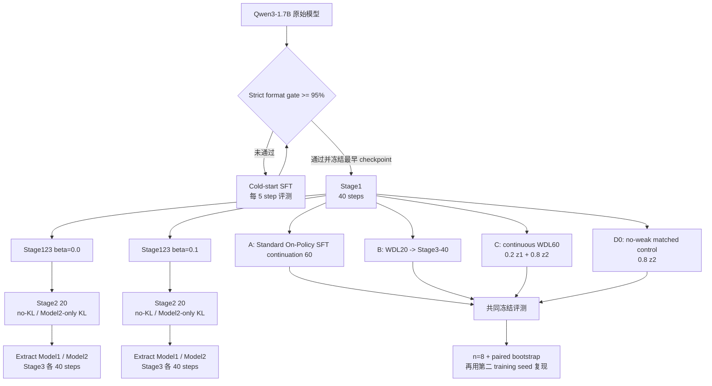

# Qwen3-1.7B 数学任务：Cold-Start、Stage123 与 WDL-first 实验方案

> 2026-08-23 status：2026-08-18 之前的历史 Math GRPO 数字仍为
> diagnostic-only；strict-scorer aligned retrain 与共同 `n=256` 已完成，
> 当前排序与证据边界见结果文档第 15 节。

- 文档职责：只描述实验问题、实验变量、训练流程、评测协议和决策标准
- 初始设计日期：2026-07-20
- 当前方案修订：2026-08-23
- 目标硬件：8 × NVIDIA L40S 46 GB
- 实验结果：[`../../reports/qwen3_1p7b_math_stage123_matrix_results_20260723.md`](../../reports/qwen3_1p7b_math_stage123_matrix_results_20260723.md)
- 飞书结果文档：[Qwen3-1.7B 数学任务实验结果与分析](https://ocnwds5io8yp.feishu.cn/docx/CFx6dw2YsoFpqzxGl61c2HRNnlh)

本文件不记录某次 run 的在线状态、具体分数或发布状态。方案中哪些假设得到支持、哪些未得到
支持及其原因，统一写入结果文档。

## 1. 实验目标与整体流程

本实验分两层回答问题。第一层用最小监督 cold-start 让模型稳定满足
`<think>...</think><answer>\boxed{...}</answer>` 输出契约，再运行 beta `0.0/0.1`、
no-KL/model2-only-KL、extracted Model1/Model2 的 Stage123 16-run 矩阵。第二层在相同
Stage1 source、相同 60-step post-Stage1 预算和相同数据顺序下，比较 A/B/C/D0，隔离
continuous WDL 中 weak-logit contribution 的作用。

当前 Math Stage123 与 WDL-first causal P60 使用同一个 CoT-mask V3 cold-start lineage；
WDL-first 从已完成的 V3 Stage1 Model2 source 出发，不再执行另一套 cold-start。未来若某批
队列更换 cold-start，必须显式列出 source model、监督数据、loss mask、format gate、
selection rule 和 checkpoint identity 的差异，不能只沿用“cold-start”这个名称。

## 2. 实验地图、假设与判定标准

| 实验 | 做什么 | 验证的问题与假设 | 正面结果标准 | 负面或不确定结果 |
| --- | --- | --- | --- | --- |
| Cold-start format admission | 从 raw model 开始，每 5 step 增加监督格式训练，选择最早通过的 checkpoint | 最小监督能否建立稳定且可评测的输出契约 | 完整 Math-7、`n=1` 的 strict complete-format `>=95%` | 40 step 内仍未达标则停止后续矩阵；不得用单项 tag rate 代替交集门禁 |
| Stage1 | beta `0.0/0.1` 各训练 40 step | 两种 beta source 是否都能提供可学习的 Stage1 初始化 | loss/gradient 有限、format/validation 健康、最终 checkpoint 完整 | 任一 source 不健康则其依赖分支不准入 |
| Stage1 control A | Stage1 Model2 在 `stage2 -> stage3` 数据上继续 60-step Standard On-Policy SFT | matched budget 下标准正样本 on-policy 训练能达到什么水平 | 作为 practical baseline，不单独定义方法成功 | A 与 treatment 接近时，treatment 不能归因于 WDL |
| Stage2 KL ablation | 每个 beta 分别运行 no-KL 与 Model2-only KL 20 step | KL 是否改善 joint Stage2 的学习、稳定性或后续 handoff | 跨 beta、跨 endpoint 方向一致，且无质量代价 | 小而不一致的差异视为未验证 |
| Stage3 extraction matrix | 从每个 Stage2 arm 提取 Model1/Model2，各继续 40 step | 两个 submodel 的可学习性是否对称；handoff 是否有价值 | matched endpoint 上稳定改善，且相对 control 有可归因优势 | 只优于自身起点但不优于 control，只能证明 pipeline 可学习 |
| H1: weak-logit contribution | 比较 C 与 matched-scale D0 | 在相同 $0.8z_2$ scale 下加入 $0.2z_1$ 是否提升 Model2 | $\Delta_{weak}=M_C-M_{D0}\ge2$ pp，paired 95% CI 下界 `>0`，至少 5/7 数据集同向，质量门禁通过 | CI 跨零为不确定；90% CI 全落入 $[-1,+1]$ pp 才支持 practical equivalence |
| H2: practical method value | 比较 C 与 A | 完整 continuous WDL 是否优于更简单的继续训练 | $\Delta_{stage1}=M_C-M_A\ge2$ pp，paired 95% CI 下界 `>0`，质量门禁通过并用第二 seed 复现 | 只优于 D0、不优于 A，说明 weak logits 有影响但方法价值未验证 |
| H3: pipeline allocation | 比较 C 与 B | WDL60 是否优于 WDL20 -> Stage3-40 的预算分配 | $\Delta_{allocation}\ge2$ pp、paired 95% CI 下界 `>0`、至少 5/7 数据集同向 | 只能解释 allocation，不能单独称为 Stage2 dose effect |
| H4: late stability | 比较 C 的 P45/P50/P60 trajectory | late-window gain 是否保持且不靠格式/长度异常 | P50->P60 non-inferiority 95% CI 下界 `>-2` pp，并通过 format/truncation gate | P60 前回落或质量崩塌时，不支持 continuous objective |

## 3. Cold-start 设计

### 3.1 目的与选择规则

Cold-start 只解决格式准入，不承担主方法的 capability 结论。队列先在 step `0` 评测原始
Qwen3-1.7B；未通过时，SFT 每次增加 5 个 optimizer step，最多到 step `40`。每个
checkpoint 使用完整 Math-7 validation、`n=1`；Stage1/2/3 capability evaluation 使用
`n=3`。

完整格式契约要求以下条件同时成立：

- 恰好一对、顺序正确且非空的 `<think>`；
- 恰好一对、顺序正确的 `<answer>`；
- `\boxed{}` extraction 成功；
- reward grader 正常执行；
- 存在 EOS 且未截断。

队列自动选择最早达到 response-level complete-format `>=95%` 的 checkpoint，并写入不可变
`model1_selection.json`。各项 tag、boxed、EOS 和 truncation rate 只用于诊断，不能代替
完整交集门禁。

### 3.2 当前 cold-start lineage

当前有效 lineage 只允许 CoT-mask V3：

- `math_qwen3_1p7b_cold_start_cotmask_v3.yaml`
- `math_qwen3_1p7b_stage123_cotmask_v3.yaml`
- `data.tokenize_whole_message=True`
- `data.ignore_input_ids_mismatch=False`

V1/V2 只保留为无效历史证据，不能作为 Model1、训练 source 或发布对象。故障原因和机器防线
见附录 A/B；具体 Step-0 与最终选择结果见结果文档。

## 4. Stage123 V3 16-run 矩阵

### 4.1 统一训练与 validation 配置

| 配置 | 值 |
| --- | --- |
| Learning rate / warmup | `1e-6` / `0` |
| Prompt batch / rollout N | `64` / `8` |
| Prompt / response length | `500` / `4096` |
| Data seed / shuffle | `20260719` / `False` |
| Fusion lambda | `0.8` |
| Validation | 完整 Math-7，`n=3`，temperature `0.2`，top-p `0.95` |
| Train / validation / save interval | 每 `5` step |
| Primary metric | `val-core/model2/math7_macro/acc/mean@3`（joint Stage2）；single-model arm 使用对应 Model2/single view |
| Model2-only KL | `low_var_kl`，coefficient `0.01` |

### 4.2 矩阵展开

beta `0.0` 和 `0.1` 使用完全 matched 的结构。对每个 beta：

1. Stage1 在 `stage1` shard 训练 40 step；
2. Stage1 control 在相同顺序的 `stage2 -> stage3` 数据上继续 60 step；
3. Stage2 no-KL 与 Model2-only-KL 分别在 `stage2` 训练 20 step；
4. 每个 Stage2 arm 分别提取 Model1 和 Model2；
5. 四个 extracted submodel 分支分别在 `stage3` 训练 40 step。

总计 16 个 run：2 个 Stage1、2 个 Stage1 control、4 个 Stage2、8 个 Stage3。Stage1
control 使用 fresh optimizer 与 warmup 配置匹配 handoff restart；它不是 Stage1 optimizer
state 的无缝 continuation。

## 5. WDL-first causal P60 设计

### 5.1 共同条件与四个 arm

所有 arm 从同一个 Stage1 Model2 checkpoint 出发，消费相同顺序的 `stage2 -> stage3`
3,840 个 prompts，`data.shuffle=False`，post-Stage1 预算均为 60 step，对应 effective step
100。共同配置为 `loss_mode=wdl_sft`、`beta=0`、no KL、LR `1e-6`、zero warmup、
Model2-only rollout、rollout `N=8`、Math-7 `n=3`、每 5 step validation。

| Arm | Stage1 后训练 | 作用 |
| --- | --- | --- |
| A: Standard On-Policy SFT continuation | 60-step single-model positive-only on-policy SFT | practical baseline |
| B: WDL20 -> Stage3-40 | 20-step joint WDL，extract Model2，再运行 40-step single-model Stage3 | historical staged-allocation baseline |
| C: continuous WDL60 | 60-step uninterrupted joint WDL；$z_{train}=0.2z_1+0.8z_2$；Model1/Model2 均更新 | 核心方法 arm |
| D0: matched-scale no-weak | 60-step uninterrupted joint-wrapper path；$z_{train}=0.8z_2$；Model1 gradient 为零，只更新 Model2 | H1 主 control |

Optional D 使用 $z_2$，只用于 direct-Model2 equivalence diagnostic。它同时改变 weak-logit
content 与 strong-logit scale，不能替代 D0，也不进入默认 causal queue。

### 5.2 Treatment admission

第一个 optimizer step 前必须生成 machine-readable receipt，证明：

- Model1/Model2、tokenizer/chat template、implementation、reward/evaluator 和 optimizer identity 固定；
- 3,840 个 source-row index、顺序、seed 与 A/B 等价；
- C 为 `mixture/0.8`，D0 为 `strong_scaled/0.8`，rollout source 均为 Model2-only；
- 替换 Model1 会改变 C 的 fused training logits，但不会改变 D0；
- C 的 Model1/Model2 gradient 均非零；D0 的 Model1 gradient 为零且 parameter hash 不变；
- 同一 frozen microbatch 上 D0 logits 在 tolerance 内等于 $0.8z_2$。

### 5.3 训练信号与健康指标

每步记录 correct ratio、positive response/token count、positive/total WDL loss、Model1/Model2
gradient、chosen-token log-prob delta、response length、EOS/truncation、optimizer step 和
distributed/runtime health。每个 validation checkpoint 同时记录 Model1/Model2 Math-7、
complete-format、boxed extraction 和 scorer failure。

这些指标解释 run 为什么学习或失败，不能代替 Model2-only held-out endpoint。D0 的
Model1 gradient 必须严格为零；C 的两个 submodel 都必须更新。任何 format-bad、
missing-answer 或 truncated response 都必须 fail closed，不能获得正 reward。

## 6. 评测与结论协议

### 6.1 Online 与 confirmatory evaluation

Online evaluation 在 P0 和其后每 5 step 直到 P60，使用完整 Math-7、`n=3`。P60 的最终
报告必须在共同冻结的 evaluator、prompt set、generation seed 和 sample count 下重评
A/B/C/D0。第一阶段 confirmatory evaluation 使用 `n=8`；最终 official sweep 使用 `n=256`，
报告 `pass@k, k={1,2,4,8,16,32,64,128,256}`。两者都保留 per-prompt/per-sample output。

Math-7 对七个数据集等权 macro average。Paired bootstrap 必须在每个数据集内部 resample
prompt，再对七个数据集等权平均，共 10,000 次；不能把所有 prompt 混在一起 bootstrap。

最终至少报告：

- Model2-only Math-7 `mean@3` 与 exact `pass@3`；
- 七个数据集各自的 mean/pass 指标和提升方向数；
- complete-format、boxed extraction、EOS、truncation 和 response-length distribution；
- $\Delta_{weak}$、$\Delta_{stage1}$、$\Delta_{allocation}$ 的 paired confidence interval；
- independent second training seed。

### 6.2 Hard stop 与质量门禁

若某 arm 持续出现 NaN/Inf、optimizer step 失败、不可恢复的 distributed/runtime failure、
truncation `>25%`，或 complete-format/boxed extraction 相比 matched start 下降 `>5pp`，
则停止该 arm。除非继续运行可能破坏 artifact，一次短暂 validation 异常不触发停止，通常
要求连续两次异常。

## 7. 后续实验顺序

只有 C 在 H1/H2 上显示核心信号后，才按以下顺序扩展：

1. **A/C/D0 peak-to-overfit sweep**：从 P60 matched continuation，保持 optimizer state、数据契约与训练顺序可比，每 5 step validation；先检查 P80/P100/P120，再按 20-step chunk 延长，暂以 P180 为硬上限。主 Math-7 指标较 running best 下降至少 2 pp、连续三个 validation 点未恢复且质量门禁未误触发时，才记为观测到过拟合。保留 peak 和 terminal checkpoint；不把“无限运行直到下降”作为执行合同。
2. **独立 training seed 复现**：A/C/D0 至少增加第二 seed；目标至少三个 seed，以便估计训练方差。第二 seed 只提供复现证据，不能产生稳健的 seed-level confidence interval。
3. **共同冻结重评与 pass@k**：在同一 prompt manifest、tokenizer/evaluator revision、generation seed list 和每 prompt 样本下重评 A/C/D0。先做 `n=8` paired confirmation，再对 P0/P60/peak/terminal 做 `n=256`，报告 pass@1 至 pass@256 的预注册 k 网格。
4. **置信区间分层**：单 seed 的 paired bootstrap 在各 Math-7 数据集内按共同 prompt 成对重采样，回答 evaluation sampling uncertainty，不要求多个 training seed；跨 seed 复现回答 optimization uncertainty。至少三个 seed 后再增加 seed-level 或 hierarchical interval。
5. **`C-fixed-WM1`（上调为机制 control）**：运行两个 Math P60 arms。二者保持
   `fusion_lambda=0.8`、`fusion_mode=mixture`、Model2-only rollout、同一 60-step ordered shard，
   只把 `freeze_model1=true` 写入 joint config；`C-fixed-M1-CS0` 让 Model2 从 CS0 开始，
   `C-fixed-M1-S1` 让 Model2 从现有 Stage1 source 开始。前者与 A 作 matched-source 比较，
   后者与 C/D0 作 matched-source 比较，共同分离 fixed weak guidance、Stage1 起点和 joint
   weak-model co-adaptation。
6. **paper-aligned OPSFT baseline**：在 A 的基础上对齐
   [`On-Policy Supervised Fine-Tuning for Efficient Reasoning`](https://arxiv.org/abs/2602.13407)
   的 correct+concise / length-filtered selected-SFT recipe，确认 A 与该 preprint 方法的距离。
   若只使用现有 A，论文口径应称为 OPSFT-like / rejection-filtered on-policy SFT variant，
   不称为 exact reproduction。
7. **GFT baseline（second-tier）**：GFT 已发表于 Findings of ACL 2026，但它把 expert
   demonstrations、teacher distillations 和 self-generated samples 组成 group，再做 group-advantage
   学习与 Dynamic Coefficient Rectification。若复现，必须额外冻结 teacher identity、teacher
   generation 成本、group composition 和 reward rule；否则只作为 related work，不进入主公平表。
8. **IDFT / continual-learning 后续实验**：IDFT 主要解决 model/data distribution mismatch，
   不作为当前 Math-first 主 baseline。后续可按逻辑推理 -> 数学 -> 代码 -> 医学 QA -> 科学 QA
   的顺序测试 A/C/D0/C-frozen/GRPO 的 catastrophic forgetting 与 retained score。
9. **Dynamic Perturbation / DynPerm**：保留为 mechanism ablation。它在每个 control forward
   内保持 weak entropy、target-token probability 和 weak value multiset，同时重排 non-target
   token assignment；它回答 token-specific weak structure 是否重要，但仍需要 WM1 logits，不能单独证明
   “不需要 Weak Model1”。若要证明可替代 WM1，还需 cached weak logits、synthetic
   entropy-matched logits 或 target-confidence-matched structureless distribution。
10. 运行 matched `beta=0.1`，检验 treatment-effect heterogeneity；增加 `WDL40 -> Stage3-20`，建立 Stage2 dose/allocation 证据；
11. 比较 optimizer-state continuation 与 fresh restart，并做 data-order intervention；继续验证“late-window 增长由 correct ratio/reward 信号密度上升驱动”的解释，而不是把相关性写成因果；
12. 每个 arm 同步报告 GPU-hours、validation/generation token、storage 与相对 A 的 gain/GPU-hour；C 更新两个 submodel，计算成本不能只按 step 数比较；
13. 基础方法确认后，在干净隔离 branch 上扩展 KL、beta/lambda grid 等 tricks，并加入至少一个其他 reasoning 域和一个 tool-use 域。

共同冻结的含义不是“使用了同名数据集和 evaluator 配置”，而是 A/C/D0 在同一次评测合同中使用同一 prompt 集、代码/权重 revision、解码参数、generation seed list 和逐 prompt sample index。现有数学 A 来自独立 inference run，样本随机数没有与 C/D0 成对，因此当前 C-A 点差仍可作描述，但不能直接用于 paired CI；这不否定点估计，只限制其统计解释。

## 8. Math n=256 pass@k 与多样性确认实验

### 8.1 实验矩阵与冻结协议

本实验回答“C 的 P60 增益是否只是把已有正确答案的概率质量集中到少数模式”，而不是重复
在线 `n=3` accuracy。评测顺序为：

1. `CS0`：CoT-mask V3 cold-start 完成、尚未进入 Stage1/A/C/D0 的共同起点；已完成；
2. `A-P60`：Standard On-Policy SFT continuation 的 Model2；
3. `C-P60`：continuous WDL 的 Model2；
4. `D0-P60`：matched-scale no-weak control 的 Model2；
5. `GRPO-P200`：标准 GRPO 第二 epoch 完成后的 endpoint；在训练通过 release gate 后再准入。

所有 arm 使用同一 Math-7 prompt manifest、tokenizer/chat template、reward/evaluator revision 和
逐 prompt sample index。冻结解码合同为 thinking enabled、temperature `0.6`、top-p `0.95`、
top-k `20`、min-p `0`、max response tokens `4096`，每个 prompt 生成 `256` 个样本，seed
从 `20260811` 按 8 个 `n=32` shard 确定性派生。正式结果报告
`pass@k, k={1,2,4,8,16,32,64,128,256}`、`maj@k`、mean@256、oracle uplift、
normalized-answer/完整 response 的 distinct rate、format/EOS/truncation、生成 token 与 GPU-hours。

预注册的 high-k 多样性门槛以 C 相对 D0 为主、C 相对 A 为辅：`pass@128` 与 `pass@256`
的 paired 95% CI 下界均需高于 `-2 pp` 才记为未发现实质性 coverage 退化；完整 response
distinct rate 的点估计下降超过 `5 pp` 记为显著锐化警报。两个门槛必须与绝对 high-k
coverage、normalized-answer distinct rate 和 format/truncation 一起解释，不能单独充当方法成败标准。

主比较为 `C-D0`（weak-logit contribution）、`C-A`（practical continuation）和 `C-CS0`
（相对训练起点的总体改变）；GRPO P200 完成后增加 `C-GRPO`。在线 temperature `0.2`、`n=3`
与本实验 temperature `0.6`、`n=256` 的绝对值不直接横向比较。

### 8.2 预注册结果解释

| 观测 | 支持的解释 | 不能推出的结论 |
| --- | --- | --- |
| C 的 pass@1 提升，pass@128/256 不降或提升，distinct 指标不降 | C 提升了正确答案概率，且没有发现明显多样性损失；若高 k 还提升，则不是单纯锐化 | 单 seed 不能证明对训练随机性稳健，也不能证明跨领域泛化 |
| C 的 pass@1 提升，高 k 基本持平，但 `pass@256-pass@1` 或 distinct rate 下降 | C 存在概率质量集中/锐化，但在本评测预算内没有损失 oracle coverage | 不能仅凭 uplift 变小就称为 mode collapse；还要看 high-k 绝对值与 distinct 指标 |
| C 的 pass@1 提升，但 pass@128/256 和 distinct 指标都明显下降 | 增益伴随可测的 diversity trade-off，需要把“更准”与“覆盖变窄”共同报告 | 不能把该 trade-off 归因于 weak logits，除非 C 相对 D0/A 的下降更大 |
| C 在高 k 上优于 D0 和 A | weak-logit treatment 在 matched endpoint 上保留或扩展了可用解空间，反对“仅锐化”解释 | 仍不能分离 joint Model1 update 与 fixed weak guidance，需 freeze-Model1 ablation |
| A/C/D0 相对 CS0 都出现类似 high-k 下降 | 更符合一般 post-training/RLVR sharpening，而不是 WDL 特有副作用 | 不能因此声称 WDL 没有额外成本；仍需看 C-D0/A 的差值与区间 |
| 只有 C 相对 D0/A 出现明显 high-k/多样性退化 | 支持 weak-logit treatment 带来额外多样性成本的质疑 | 单 seed 仍不足以估计 optimization uncertainty |

paired bootstrap 只度量共同评测样本下的 sampling/prompt uncertainty。training seed 的复现需要
独立训练 run；至少三个 training seed 后再做 seed-level 或 hierarchical interval。本矩阵也不能
验证 unseen domain、不同 temperature 下的 Pareto 曲线或 Model1-freeze 机制。

### 8.3 CS0 与 C-P60 首批 n=256 结果（2026-08-15）

CS0 与 C-P60 已按 8.1 的共同冻结合同完成全部 7 个数据集、2,798 个 prompts 和每 prompt
256 个样本，共计各 716,288 个 responses。下表为 Math-7 数据集等权宏平均；百分点差均为
`C - CS0`。A、D0 与两个 LR `1e-6` GRPO effective-P200 endpoint 仍沿用同一评测和绘图入口，
完成后直接追加到同一表与同一组曲线。

| 指标 | CS0 | C-P60 | C - CS0 |
| --- | ---: | ---: | ---: |
| pass@1 | 32.72% | 71.97% | +39.25 pp |
| pass@128 | 81.54% | 87.96% | +6.42 pp |
| pass@256 | 84.38% | 88.94% | +4.56 pp |
| maj@256 | 52.97% | 80.95% | +27.97 pp |
| 完整 response distinct rate | 94.80% | 96.31% | +1.51 pp |
| 每 prompt 平均 unique response 数 | 242.69 | 246.55 | +3.86 |
| 每数据集平均 normalized-answer unique count | 44.26 | 3.96 | -40.30 |
| truncation rate | 11.01% | 17.75% | +6.74 pp |

难题上的绝对 coverage 同时提高：MATH-500 pass@1/pass@256 从 `24.31%/89.60%` 提升到
`78.64%/97.20%`，AIME-2025 从 `0.17%/20.00%` 提升到 `17.43%/43.33%`，AMC-2023 从
`7.65%/85.00%` 提升到 `54.05%/92.50%`。因此现有结果不是“只提高 pass@1、同时压低总体
pass@256”的简单失败模式。

但结果也不能写成“多样性完全无损”。完整文本 distinct rate 略升，而 normalized final-answer
种类大幅收窄，说明 C 把概率质量集中到更少的最终答案；SVAMP、AQUA、MAWPS、GSM8K 这些
高覆盖数据集的 pass@256 还分别下降约 `2.33/2.76/0.56/0.83 pp`。宏平均 truncation 上升主要
由 AIME-2025 与 AMC-2023 的长输出驱动。当前最准确的表述是：C 显著提高低 k accuracy 和
majority stability，宏平均 high-k coverage 仍提升，但存在可测的 answer-level sharpening 与
长输出风险。是否为 WDL 特有成本必须等待 C-D0、C-A 与 C-GRPO，而不能仅用 C-CS0 归因。

统一入口为
`docs/joint_training/reports/scripts/plot_qwen3_1p7b_math_offline_passk_diversity.py`；它读取各 arm
共同格式的 `merged/eval_metrics.json`，缺失 arm 在 summary CSV 中保留 `pending`，后续只需
补充结果路径并重跑同一脚本。当前输出为：

- `docs/joint_training/reports/data/qwen3_1p7b_math_offline_passk_summary.csv`；
- `docs/joint_training/reports/data/qwen3_1p7b_math_offline_passk_by_dataset.csv`；
- `docs/joint_training/reports/figures/qwen3_1p7b_math_offline_passk_macro_curve.{png,pdf}`；
- `docs/joint_training/reports/figures/qwen3_1p7b_math_offline_diversity_tradeoff.{png,pdf}`。

## 9. Standard GRPO 第二 epoch 饱和度基线

### 9.1 训练矩阵与 resume 语义

第二 epoch 只在 Math 上运行，用来判断此前一个 epoch 的 GRPO endpoint 是否明显欠训练。
四个 arm 均从已完成且通过来源门禁的第一 epoch checkpoint 原位 resume：

| 初始化与 LR | 第一 epoch endpoint | 第二 epoch endpoint | 说明 |
| --- | ---: | ---: | --- |
| Cold Start + GRPO，LR `1e-6` | P100 | P200 | 重复完整 6,400-prompt Stage1→Stage2→Stage3 数据序列 |
| Cold Start + GRPO，LR `5e-7` | P100 | P200 | 与上行只改变 LR |
| Stage1 + GRPO，LR `1e-6` | local P60 / effective P100 | local P160 / effective P200 | resume 后运行 100 step；前 60 step 消费 Stage2→Stage3，第二轮从 Stage1 数据起重新走满 6,400 prompts |
| Stage1 + GRPO，LR `5e-7` | local P60 / effective P100 | local P160 / effective P200 | 与上行只改变 LR |

这里的“再训练 100 step”按用户冻结的有效 budget 口径定义：所有 arm 的 effective endpoint
统一到 P200；Stage1 + GRPO 的本地 trainer step 因初始化已经包含 Stage1 40-step 能力预算而记为
P160。resume 必须保留 model、optimizer、RNG 和 LR scheduler state，不重启 warmup；
`shuffle=False`，只把 dataloader cursor 重置到冻结的 6,400-prompt 序列起点。checkpoint 只保留
阶段语义节点、best 与 latest，禁止按高频 save interval 无界保留。

### 9.2 预注册结果解释

| 第二 epoch 结果 | 应得结论 | 仍然不能声称 |
| --- | --- | --- |
| GRPO 快速上涨并接近或超过 C | 第一 epoch 的 GRPO baseline 欠训练；用 P100 比较 WDL 与 GRPO 不公平，必须改用 P200/peak 或 compute-matched endpoint | 不能据此否定 WDL；还需比较达到同等分数所需的 GPU-hours、tokens 和 wall time |
| GRPO 继续上涨，但 P200 仍明显低于 C | 在当前 recipe 与 2-epoch budget 下，C 的 sample/step efficiency 更高 | 不能声称 WDL 的最终 ceiling 更高，因为 GRPO 可能在更长训练后继续增长 |
| GRPO 曲线趋平或回落，且训练/评测健康 | 当前标准 GRPO recipe 已接近局部 peak，支持 C 在当前 endpoint 上又快又强 | 单 seed、单模型规模和单任务不足以支持方法级普遍优越性 |
| 仅 LR `1e-6` 明显改善 | GRPO 对 LR 敏感；正式 baseline 应报告两档 LR 并以预注册规则选择 peak | 不能只保留较好 LR 而隐藏另一档，也不能把 LR 敏感性写成 WDL 的因果优势 |
| Stage1 与 Cold Start 的排序改变 | 初始化和训练数据分配与第二 epoch 存在交互，需要分别报告两种起点 | 不能把差异简单归因于“是否需要 Stage1” |
| reward/advantage/grad 长期近零或 evaluator/format 异常 | 本轮不能作为 saturation 证据，先按实现或任务难度分布故障处理 | 失败配置不能用于证明 GRPO ceiling 低 |

训练结论必须同时报告 reward density、all-correct/all-wrong group 比例、advantage 非零率、policy
loss、grad norm、KL、clip fraction、format/truncation 与 held-out validation。WDL 的 C arm 同时更新
两个模型，GRPO 只更新一个模型，因此 step-matched 比较只回答 wall-clock pipeline 的实际表现；
公平的算法效率结论还必须增加 rollout tokens、训练 FLOPs/GPU-hours 和达到同一质量阈值所需成本。

### 9.3 当前结果与 P198 口径（2026-08-14）

| Arm | 实际 / effective 终点 | 最新验证 | 峰值 | 发布边界 |
| --- | --- | ---: | ---: | --- |
| Cold Start + GRPO，LR `1e-6`（Job 68） | actual P198 / effective ≈P200 | P195：68.54% | P160：68.82% | 正常退出，gate BLOCKED |
| Stage1 + GRPO，LR `1e-6`（Job 72） | local P160 / effective P200 | P160：68.37% | local P155：68.90% | terminal artifact 完整，gate BLOCKED |
| Cold Start + GRPO，LR `5e-7`（Job 73） | actual P198 / effective ≈P200 | P195：50.70% | P195：50.70% | 正常退出，gate BLOCKED |
| Stage1 + GRPO，LR `5e-7`（Job 74） | receipt snapshot local P99 / effective P139 | P95：46.95% | P90：47.06% | 仍在健康运行，gate BLOCKED |

Job 68/73 的 P198 不是 prompt 数量不同造成的：四个 arm 均读取相同的 6,400-row 序列，长度过滤后
均为 6,324 行，即 98 个完整 batch。checkpoint 未恢复 dataloader cursor 时，trainer 根据本地
`global_steps // 98` 反推 epoch；P100 source 被判为 epoch 1，只再执行 98 步，而 local P60 source
被判为 epoch 0，仍可由 hard cap 跑满 100 步。这是 trainer resume bookkeeping 缺陷。

本方案接受 P198 作为 effective ≈P200 的预算近似点，因为只差 1% update；但结果表必须保留
actual P198，指标采用真实存在的 P195 validation，不能把 artifact 或 gate 伪装成 P200。

与 WDL C 比较：C 的在线 peak/P60 为 71.16%/70.80%；当前最佳 GRPO peak 为 68.90%，Job 72
terminal 为 68.37%。因此在当前单 seed、在线 n=3 和扩展 budget 下，C 仍领先约 2.26–2.43 pp。
这支持 WDL 的短程效率与当前 endpoint 优势，但尚不证明最终 ceiling；Job 74、共同冻结 n=256
与多 seed 仍是结论门禁。

### 9.4 GPU-hours / tokens / FLOPs 预算披露（2026-08-14）

预算与绘图使用统一入口
`docs/joint_training/reports/scripts/plot_qwen3_1p7b_math_grpo_wdl_results.py`，输出
`docs/joint_training/reports/data/qwen3_1p7b_math_grpo_wdl_budget_estimate.csv`。估算采用精确参数量
`1,720,574,976`，dense forward `2 * params * tokens`、training forward/backward
`6 * params * tokens`。WDL C 按两个 submodel 计，GRPO 按一个 actor 加 old-log-prob 与 reference
forward 计。GPU-hours 从 metrics 中分拆训练 `timing_s/step` 与在线评测 `timing_s/testing`，两者都乘
8 卡；这不是 Slurm accounting，也不是 profiler trace。

| Arm | 质量 peak / latest | 训练 generated tokens | online val tokens target / all | 8×GPU-hours train / val / total | rollout / old / ref forward FLOPs | train FLOPs | total FLOPs train-pipeline / incl. val |
| --- | ---: | ---: | ---: | ---: | ---: | ---: | ---: |
| WDL C P60 | 71.16 / 70.80 | 23.57M | 59.41M / 119.54M | 17.67 / 61.46 / 79.13 | 0.162 / 0.196 / 0 e18 | 0.589e18 | 0.947 / 1.358 e18 |
| GRPO Stage1 LR `1e-6` effective P200 | 68.90 / 68.37 | 103.21M | 178.64M / 178.64M | 83.15 / 49.21 / 132.36 | 0.355 / 0.401 / 0.401 e18 | 1.202e18 | 2.358 / 2.972 e18 |
| GRPO Cold Start LR `1e-6` ≈P200 | 68.82 / 68.54 | 175.74M | 248.29M / 248.29M | 131.88 / 67.06 / 198.94 | 0.605 / 0.661 / 0.661 e18 | 1.983e18 | 3.909 / 4.764 e18 |
| WDL D0 P60 | 67.86 / 67.39 | 18.11M | 42.70M / 91.42M | 13.86 / 59.38 / 73.24 | 0.062 / 0.159 / 0 e18 | 0.476e18 | 0.697 / 1.011 e18 |

该表给出的初步结论比 step proxy 更强：即使把 WDL C 的在线 validation timing 计入，WDL C
仍比当前两个 LR `1e-6` GRPO P≈200 arm 使用更少 active GPU-hours、训练 generated tokens 和估算
training FLOPs，同时 quality endpoint 更高。因此当前证据支持“WDL C 在本任务/seed/online n=3
下更快且当前预算更强”。但这仍不是最终 ceiling 结论：GRPO 更长 saturation、共同冻结 pass@k 和
多 seed 仍可能改变方法级判断。

GRPO 内部曲线与 GRPO-vs-WDL 曲线分别输出为
`docs/joint_training/reports/figures/qwen3_1p7b_math_grpo_internal_curve.{png,pdf}` 与
`docs/joint_training/reports/figures/qwen3_1p7b_math_grpo_vs_wdl_curve.{png,pdf}`。LR `1e-6` 的
Cold Start / Stage1 initialization endpoint 接近，初始化差异可在附录记录为小效应；LR `5e-7`
明显落后，说明 canonical GRPO baseline 对 LR 敏感。

## 附录 A：Cold-start loss-mask 事故

Cold-start V1（LR `2e-5`）和 V2（LR `5e-6`）逐轮渲染 assistant message。Qwen3 Thinking
template 依赖上下文，单独渲染会移除 reasoning，使 loss mask 只监督 `<answer>` 与 EOS。
`ignore_input_ids_mismatch=True` 只隐藏警告，没有修复监督范围。

V3 改为 whole-message tokenization，并用真实 tokenizer regression test 和完整 1,100 行
probe 验证 `<think>`、reasoning、`</think>`、`<answer>` 和 EOS 都进入 loss，而 system/user
不进入 loss。V1/V2 checkpoint 永久无效，不能选作 Model1 或发布到 DB/W&B。

## 附录 B：机器强制门禁

1. CPU regression test 覆盖依赖上下文的 Qwen Thinking template 和 assistant span；
2. `scripts/check_sft_loss_mask_policy.py` 拒绝 allowlist 外的 mismatch override；
3. pre-push/CI 运行 policy canary 与 regression test；
4. `scripts/math_cold_start_queue.py` 在 optimizer step 前对全部 1,100 样本运行真实 tokenizer preflight；
5. causal queue 绑定 strict scorer path/SHA256，并运行 missing-`<answer>` negative canary。

## 附录 C：冻结的数据契约

数据源为 `/data-1/dataset/math/train_rl_format.parquet`，共 7,500 条 MATH 数据，使用 seed
`20260719` permutation 并在 shard 内保序。

| Shard | 行数 | 用途 |
| --- | ---: | --- |
| `cold_start` | 1,100 | format SFT |
| `stage1` | 2,560 | 40 × 64 prompt |
| `stage2` | 1,280 | 20 × 64 prompt |
| `stage3` | 2,560 | 40 × 64 prompt |

四个 shard 两两不重叠。`stage1_control` 唯一有意复用数据，严格按 `stage2 -> stage3`
拼接，使 control 与 treatment 消费相同的 3,840 个有序 prompt。`dataset_receipt.json` 记录
source/shard hash、source row index、顺序和 overlap policy。

## 附录 D：执行与发布门禁

- launch 前确认 GPU 空闲、dataset receipt、loss-mask receipt、model/source identity 和 evaluator contract；
- queue/monitor 使用独立 tmux 和 append-only ledger；
- checkpoint 必须包含要求的 model/optimizer/extra shard；
- failed/incomplete run 仅作本地诊断证据；
- DB import 或 W&B sync 前必须通过 `scripts/training_result_release_gate.py`。

这些门禁保证实验可以被信任，但不构成方法设计或正面实验结论。

## 附录 E：被 WDL-first 设计取代的 Stage2-extension 方案

2026-07-23 曾计划从 Stage2 P20 merged weights 以 fresh optimizer 继续到逻辑 P40/P45/P60，
并增加 canonical unseen-data、Stage3-prefix replay/shuffle 和 Stage3 handoff timing。该方案同时
混入 fresh restart、data window 和 handoff allocation，不能优先回答 weak-logit contribution。

2026-07-26 起由 A/B/C/D0 matched-budget causal design 取代。原方案只保留三个后续问题：

- `WDL40 -> Stage3-20` 用于 dose/allocation；
- deterministic reshuffle/window relocation 用于 data-order；
- optimizer-state continuation vs fresh restart 用于 optimizer semantics。

## 附录 F：设计到结果的映射

| 内容 | 权威位置 |
| --- | --- |
| 方案中哪些实验已完成、有效或作废 | [本地结果文档](../../reports/qwen3_1p7b_math_stage123_matrix_results_20260723.md) |
| 全部 validation step / 分数据集结果 / 训练动态 | `../../reports/data/qwen3_1p7b_math_stage123_*.csv` |
| 飞书实验结果与汇报口径 | [飞书结果文档](https://ocnwds5io8yp.feishu.cn/docx/CFx6dw2YsoFpqzxGl61c2HRNnlh) |
| 本地 registry / release gate / W&B publication | 结果文档的发布状态章节 |

## 附录 G：Model1 / Model2 子模型动力学（2026-08-16 补充）

### G.1 身份与评测口径

Model1 与 Model2 使用相同的 Qwen3-1.7B 架构、tokenizer 和 chat-template 合同，但权重并不相同。Math Model1 是 task-specific cold-start SFT 的 step20；Model2 从同一 Model1 step20 继续完成 40 step Stage1 standard on-policy positive-only SFT。C 使用 `0.2z1 + 0.8z2` 生成分布并同时更新两个子模型；D0 使用 `0.8z2`，Model1 按设计冻结、梯度为 0 且 hash 不变。两条 arm 的 online validation 都从 P0 到 P60 每 5 step 保存 Model1 与 Model2 的原生逐样本结果。

| Arm / view | P0 Math-7 mean@3 | P60 Math-7 mean@3 | 变化 | best | 原生截断 P0→P60 | format success P0→P60 |
|---|---:|---:|---:|---:|---:|---:|
| C Model1 | 39.02% | **71.04%** | +32.02 pp | P60 71.04% | 8.90%→4.54% | 89.83%→95.21% |
| C Model2 | 42.61% | 70.80% | +28.20 pp | P55 71.16% | 7.16%→4.37% | 92.39%→95.58% |
| D0 Model1（冻结诊断） | 38.80% | 38.77% | -0.03 pp | P10 39.39% | 9.00%→8.69% | 89.82%→90.16% |
| D0 Model2 | 42.50% | 67.39% | +24.90 pp | P50 67.86% | 6.75%→3.33% | 92.74%→96.57% |

### G.2 当前可以与不能得到的结论

- C 中 Model1 从更弱的初始化追平 Model2，且其 +32.02 pp 增益远大于 5.38 pp 的 format 提升，说明 Math 上不是单纯格式修复。由于 rollout source 是 Model2，这一现象更符合“通过 verifier 筛选的 Model2 rollout 对 Model1 发生在线隐式蒸馏”，不能表述为 Model1 独立探索得到同等能力。
- D0 Model1 基本水平，正是冻结干预隔离成功的预期证据，不是“Model1 训练失败”。D0 Model2 的提升证明不含 weak logits 时 Model2 仍可学习；C 相对 D0 的差异仍是 weak-logit contribution 的主要对照。
- C P60 的 Model1/Model2 只差 0.24 pp，小于当前单 seed、online `n=3` 能稳定解释的尺度。总分接近不代表两者逐题知识、错误集合或回答多样性相同。

### G.3 迫切需要补的机制实验

1. **现有产物的成对分析（P0，立即做）**：按相同 prompt/sample index 统计 both-correct、Model1-only、Model2-only、both-wrong、正确集合 Jaccard 和 paired bootstrap；同步跟踪长度、原生截断、format、答案相似度和归一化答案多样性。
2. **C-freeze-Model1（P1，首要新增训练）**：保持初始化、数据顺序、seed、budget 与 `0.2z1+0.8z2` 不变，只冻结 Model1，对比 C-joint 与 D0。若 freeze≈joint，主要机制是 fixed weak guidance；若 joint 明显更好，说明 Model1 自适应更新/协同演化有贡献；若 freeze≈D0，则当前有效性依赖可训练 Model1 或固定弱模型信号不足。
3. **独立子模型与 fused 评测（P1）**：在 P0/P30/P45/P55/P60 同时评 Model1、Model2 与 fused policy，区分“两个子模型各自增强”和“只在融合分布上增强”。
4. **第二 seed 与 offline `n=256`（P1/P2）**：对 C-joint、C-freeze-Model1、D0 增加至少一个 seed，并对 Model1/Model2 共同冻结 pass@k/diversity，检验追平是否可复现以及是否伴随多样性收缩。
5. **role-swap / identical-init（P2，较低优先级）**：交换弱强角色或令两者同初始化，判断效果来自角色不对称、初始化差异还是双模型容量本身。

统一数据表与绘图入口：`docs/joint_training/reports/data/qwen3_1p7b_acd0_submodel_online_validation.csv` 和 `docs/joint_training/reports/scripts/plot_qwen3_1p7b_acd0_submodel_dynamics.py`。
