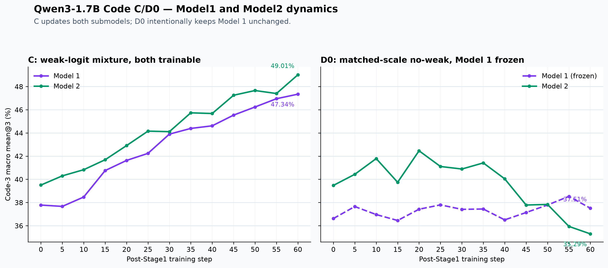

# Qwen3-1.7B 数学与代码 beta=0 A/C/D0 P60：实验方案与代码结果分析

本文沿用 1.7B 数学任务的写法：先写实验方案，再写实验结果分析。代码任务 A、C、D0 均已到达 step60，并通过 training result release gate。C 从 step30 checkpoint 恢复后完成剩余训练，step60 `success_complete` 已覆盖此前的 step30 failed event。以下比较只使用相同 P60 endpoint；其中 C-D0 是 weak-logit contribution 的主要对照，C-A 是 practical continuation 对照。

## 0. 当前状态总览

| 问题 | 当前状态 | 证据与边界 |
|---|---|---|
| 数学任务是否支持 Stage2 直接跑 60 step | 已支持 | 数学 A/C/D0 P60 经验表明，60-step Stage2 可行且优于旧的 Stage2 20 + Stage3 路线 |
| 代码任务是否复用 Stage1 | 已复用 | 直接从已完成的 Code beta=0 Stage1 Model2 启动，不重训 Stage1，也不恢复旧 optimizer |
| 代码 A 是否完成 | 已完成 | `CODE-WDL-ACD0-P60-ARM-A-QWEN3-1P7B_1785319831` 到达 60/60，release gate 为 ALLOWED |
| 代码 D0 是否完成 | 已完成 | `CODE-WDL-ACD0-P60-ARM-D0-QWEN3-1P7B_1785430935` 到达 60/60，release gate 为 ALLOWED |
| 代码 C 是否完成 | 已完成 | `CODE-WDL-ACD0-P60-ARM-C-QWEN3-1P7B_1785746593` 到达 60/60，最终 checkpoint、metrics 与 raw validation 齐全，release gate 为 ALLOWED |
| 当前主要质量风险 | LCB 长输出截断 | C P60 的 LiveCodeBench truncation 为 37.95%，低于 A 的 53.96% 和 D0 的 60.93%，但仍明显高于 HumanEval+/MBPP+ |
| 发布状态 | Registry 已修正；W&B auth blocked | 三个 run 的 release gate 均为 ALLOWED；C 已作为 `training_run_id=96` / `experiment_id=115` 干净导入，真实合同与 final validation 已核验；W&B gated sync 因容器内无 API key 失败，无 synced marker/remote URL |

## 1. 实验目标与整体流程

这组实验的核心问题是：数学任务上已经验证成功的 60-step continuous Stage2，能不能快速迁移到代码任务；以及在相同 post-Stage1 预算下，weak logits 是否真的带来可归因收益。

数学任务给出的经验是：不再优先使用 “Stage2 20 step + Stage3” 的旧拓扑，而是在 Stage2 连续跑满 60 step。代码任务据此迁移 A/C/D0 结构：A 是 ordinary continuation baseline；D0 是 matched-scale no-weak control，用于隔离 C 中弱模型 logits 的贡献；C 是 weak-logit treatment。三组现已在相同 P60 endpoint 完成，可以进行冻结合同内的对照分析。

## 2. 数学实验方案

数学实验是代码迁移的依据。它在同一个 Stage1 Model2 source、同一个 60-step post-Stage1 预算和同一个数据顺序下比较 A/C/D0：

| Arm | 训练形式 | 作用 |
|---|---|---|
| A | Stage1 Model2 单模型继续训练 60 step | 同预算 ordinary-training baseline |
| C | joint WDL，`fusion_mode=mixture`，$z_{train}=0.2z_1+0.8z_2$，60 step | weak-logit treatment |
| D0 | joint-wrapper path，`fusion_mode=strong_scaled`，$z_{train}=0.8z_2$，60 step | 匹配强模型尺度的 no-weak control |

三组实验均使用 beta `0.0`、no KL、Model2 rollout、相同有序 3,840-row post-Stage1 shard，并保留 P20/P40/P45/P50/P60 checkpoint。D0 匹配 C 的 strong-logit scale，因此 C-D0 的差异才可以解释为 weak-logit contribution。

## 3. 代码实验方案

代码任务保持数学任务的因果结构，只替换任务相关部分：prompt、reward、Code-3 validation 和官方代码执行环境。

| Arm | 初始化与训练 | 作用 |
|---|---|---|
| A | 从完成的 Code beta=0 Stage1 final Model2 启动 fresh optimizer，单模型训练 60 step | 代码任务 ordinary continuation baseline |
| C | Model1 使用 Cold Start step20；Model2 使用 Code beta=0 Stage1 final；Model2 rollout；mixture lambda=0.8；训练 60 step | 已完成的 weak-logit treatment |
| D0 | 输入、数据、rollout source 和预算与 C 相同；`strong_scaled` lambda=0.8；Model1 必须零梯度 | matched-scale no-weak control |

队列顺序为 A → D0 → C。A 先给出 continuation baseline；D0 再给出 no-weak matched control；C 最后回答 weak-logit contribution。代码任务不再运行 Stage3。

beta `0.0` 的精确含义是没有 negative-loss gradient contribution。错误 rollout 仍然生成、执行、打分，也仍然进入 incorrect set；`loss_negative` 仍会计算和记录。总 loss 为 $L=L^+ + 0\cdot L^- = L^+$。因此，正确表述是 “没有负样本梯度贡献”，不是 “没有负样本”。

## 4. Stage1 复用与格式门禁

代码 Format Evaluator 是 fail-closed 的。正样本必须同时满足：唯一、非空、闭合且顺序正确的 `<think>`；唯一、闭合且顺序正确的 `<answer>`；`<answer>` 内存在非空 Python fenced block；原生 EOS 存在且不是 `finish_reason=length`；抽取、执行和打分链路正常。

历史 artifact 里 `truncated=0` 是 EOS telemetry 接线错误，不是真实情况。原生 generation telemetry 显示，Stage1 step40 有 1,891/4,137 个响应以 `finish_reason=length` 截断，占 45.71%。格式失败 1,896 个，其中 1,891 个来自 length stop，占 99.74%。

| Step | Strict format | Correct / usable positive |
|---:|---:|---:|
| 0 | 52.16% | 34.42% |
| 5 | 52.02% | 34.35% |
| 10 | 51.61% | 33.60% |
| 15 | 52.02% | 33.89% |
| 20 | 51.70% | 34.78% |
| 25 | 51.95% | 33.74% |
| 30 | 51.97% | 34.88% |
| 35 | 53.15% | 34.95% |
| 40 | 54.17% | 36.57% |

在没有被 length stop 截断的响应中，格式能力已经很高：

| Source | 未截断响应 strict-format |
|---|---:|
| HumanEval+ | 99.43% |
| MBPP+ | 99.64% |
| LiveCodeBench | 100.00% |
| Micro | 99.78%（2241/2246） |

这说明代码任务的 raw strict-format 低，主要不是标签格式不会写，而是长输出没有在 token budget 内结束。按照 step40 的 usable-positive rate 36.57% 估计，每组 8 个 rollout 平均约 2.93 个正样本。

## 5. 代码评测环境与 release gate

代码任务使用同一套 official evaluator 环境：HumanEval+ / MBPP+ 使用 EvalPlus official implementation；LiveCodeBench 使用 official repository 与 frozen release-v5 SQLite input/output index；代码执行使用 Firejail 隔离。

训练结果发布遵循 `scripts/training_result_release_gate.py`。A、C、D0 均已通过 gate，说明三个训练结果都可作为 completed training evidence 发布。C 已经由 ACD0-aware importer 干净导入本地 registry：`training_run_id=96` / `experiment_id=115`，真实 beta/lr/length/val_n、arm/fusion 和三项 P60 final validation 已核验，online validation 与 checkpoint artifacts 为 `1001/1002`。W&B offline run 已定位到 `/data-2/wandb_runs/CODE-WDL-ACD0-P60-ARM-C-QWEN3-1P7B/wandb/offline-run-20260804_153645-bqiplz3n`。gated sync 已实际尝试，但容器内无 API key，返回 `No API key configured`，因此没有 synced marker 或 remote URL。C 的退出阶段 `BrokenPipe` 发生在 metrics 与 run summary 完成之后，不影响训练完成判定，也不是 cloud sync 证据。

## 6. 代码训练结果：终止状态

| Arm | Run | 终止状态 | Release gate | 说明 |
|---|---|---:|---|---|
| A | `CODE-WDL-ACD0-P60-ARM-A-QWEN3-1P7B_1785319831` | 60/60 | ALLOWED | 单模型 continuation，从 Stage1 Model2 出发 |
| D0 | `CODE-WDL-ACD0-P60-ARM-D0-QWEN3-1P7B_1785430935` | 60/60 | ALLOWED | matched-scale no-weak；`model1_grad_norm=0` 符合预期 |
| C | `CODE-WDL-ACD0-P60-ARM-C-QWEN3-1P7B_1785746593` | 60/60 | ALLOWED | resume wrapper 写入 step60 `success_complete`，覆盖此前 step30 failed event |

## 7. 代码训练结果：主曲线与汇总表

图 1：Qwen3-1.7B Code beta=0 A/C/D0 P60 Code-3 mean@3。

| Arm / view | Status | Best step | Best Code-3 mean@3 | Latest / P60 Code-3 mean@3 | Latest / P60 HumanEval+ | Latest / P60 MBPP+ | Latest / P60 LiveCodeBench | Latest / P60 LCB truncation |
|---|---|---:|---:|---:|---:|---:|---:|---:|
| A | complete P60 | 60 | 42.87% | 42.87% | 55.49% | 38.71% | 34.41% | 53.96% |
| C model2 | complete P60 | 60 | 49.01% | 49.01% | 64.23% | 42.06% | 40.74% | 37.95% |
| D0 model2 | complete P60 | 20 | 42.46% | 35.29% | 45.93% | 35.10% | 24.85% | 60.93% |
| D0 model1 | complete P60 | 55 | 38.53% | 37.51% | 45.93% | 35.36% | 31.22% | 60.33% |

A 是机械和指标都健康的 continuation baseline：P60 是 best checkpoint，Code-3 mean@3 为 42.87%。D0 model2 在 P20 达到 42.46% 后持续回落，P60 为 35.29%。C model2 在 P60 达到自身最佳 49.01%。相同 P60 endpoint 下，C-D0 model2 为 **+13.72 pp**，这是 weak-logit contribution 的主要对照；C-A 为 **+6.14 pp**，表示相对 ordinary continuation 的 practical gain；A-D0 为 **+7.58 pp**。D0 model1 只作为 diagnostic view。

C step60 的训练机械状态正常：`optimizer_step_applied=1`，actor grad norm 为 39.7775，model1/model2 grad norm 为 9.0536/36.6810，`grad_clip_event=0`，aborted ratio 为 0，response clip ratio 为 2.7344%，correct ratio 为 65.625%。全部 `code_reward_dependency_error` 指标值为 0；指标名称本身不是依赖缺失证据。

## 8. P60 completion 与格式质量

图 2：D0 model2 completion / format quality。

| Source | C truncation | C format success | C mean@3 | D0 truncation | D0 format success | D0 mean@3 |
|---|---:|---:|---:|---:|---:|---:|
| HumanEval+ | 9.76% | 90.04% | 64.23% | 19.72% | 79.67% | 45.93% |
| MBPP+ | 10.85% | 89.07% | 42.06% | 17.81% | 82.01% | 35.10% |
| LiveCodeBench | 37.95% | 62.05% | 40.74% | 60.93% | 39.07% | 24.85% |

C 在三个 source 上都同时降低 truncation、提高 format success 和 mean@3。LiveCodeBench 上，C truncation 比 D0 低 22.98 pp、比 A 低 16.01 pp，但 37.95% 仍是 C 的主要质量瓶颈。这里的 truncation 来自原生 `finish_reason=length` / `response_eos_present`，raw format failures 与 length stop 几乎逐条对齐；不能使用旧 artifact 中错误的 `truncated=0`。

按 raw P60 输出对 `P(correct)=P(non-truncated) * P(format-valid | non-truncated) * P(correct | format-valid)` 做三因素对称 Shapley 分解：

| 对照 | 净 Code-3 差值 | completion / 非截断 | 完成后的残余格式 | format-valid 后的条件正确率 |
|---|---:|---:|---:|---:|
| C - A | +6.14 pp | +8.93 pp（145.36%） | +0.01 pp（0.17%） | -2.80 pp（-45.53%） |
| C - D0 | +13.72 pp | +8.13 pp（59.24%） | +0.11 pp（0.82%） | +5.48 pp（39.94%） |

因此 C 相对 A 的当前净收益来自更少截断、更多完成，条件正确率反而抵消一部分收益；C 相对 D0 则同时有 completion 与语义正确性收益。控制 completion 后，残余格式贡献接近零。

逐行新增正确样本分解给出相同方向的证据：A、C、D0 的 P60 raw validation 均为 4,137 行，C-vs-A 与 C-vs-D0 的 `input`、`gts`、`data_source` 全部对齐。C 相对 D0 新增的 764 个正确样本中，437 个发生在 D0 被截断或 format contract 失败的位置，占 57.2%；LiveCodeBench 上为 344/487，占 70.6%。C 相对 A 新增的 518 个正确样本中，325 个发生在 A 被截断或 format contract 失败的位置，占 62.7%；LiveCodeBench 上为 223/312，占 71.5%。这只能作为描述性归因，不能等价为“baseline 不截断就一定答对”。

## 9. 当前结论与证据边界

同一 P60 endpoint 的 A/C/D0 结果支持三点：

1. 单模型 continuation A 在代码任务上可以继续学习，且 P60 仍是最佳点。
2. D0 的 matched-scale no-weak 路径可以机械完成 60 step，但 model2 质量从 P20 后退化至 35.29%。
3. C P60 达到 49.01%，相对 D0 model2 的 +13.72 pp 是本矩阵对 weak logits 贡献的主要证据；相对 A 的 +6.14 pp 是 practical continuation 对照。C 同时显著降低 LCB truncation。

这一结论仍限于单个 frozen seed/order、单个 P60 endpoint 与 online Code-3 validation。它支持“在本合同内 C 优于 matched-scale no-weak D0”，但不能单独证明跨 seed、跨 budget 或 offline official evaluation 的普遍收益，也不能把 A-C 当成纯 weak-logit 因果效应。

### 9.1 后续确认实验与质疑清单

1. A/C/D0 从 P60 做 matched peak-to-overfit sweep：每 5 step validation，优先 P80/P100/P120，之后按 20-step chunk，暂以 P180 为硬上限；主指标较 running best 下跌至少 2 pp 且连续三个点未恢复才记为过拟合。P60 已用完 3,840 行 shard，第二遍数据或新 shard 必须提前冻结且三臂一致。
2. 数学与代码 A/C/D0 至少增加第二 training seed；目标三个 seed 才适合稳定估计 seed 间方差。
3. 数学与代码对 P0/P60/peak/terminal 做共同冻结 `n=256` official evaluation，报告 pass@1/2/4/8/16/32/64/128/256，并保留 per-prompt 样本。
4. paired bootstrap CI 与多 seed 回答不同问题：前者对共同 prompt 输出重采样、衡量评测采样不确定性，不要求多个 training seed；后者衡量训练可复现性，二者都要补。
5. 较低优先级增加 `C-joint` 对 `C-freeze-model1`，分离 adaptive weak update 与 fixed weak guidance。
6. 延长训练时继续跟踪 LCB 原生 truncation，但不预设它一定随步数下降。
7. 逐 arm 报 GPU-hours、sandbox/validation 时间、生成 token、storage 和相对 A 的 gain/GPU-hour；C 更新两个 submodel，不能只按步数比较成本。
8. 基础矩阵确认后，在干净 branch 上逐步加入 tricks，并扩展至少一个其他 reasoning 域和一个 tool-use 域。

D0 的退化是结果，也是待解释的不稳定性；不能因为它退化就取消 matched-scale 对照。peak sweep 与跨 seed 复现将判断这是稳定设定缺陷、随机波动还是预算效应。

## 10. 本地产物与附件

飞书文档末尾已上传两张曲线图，以及两份 CSV 数据附件：

| 产物 | 路径 |
|---|---|
| 在线 validation CSV | `docs/joint_training/reports/data/qwen3_1p7b_code_acd0_p60_online_validation.csv` |
| 汇总 CSV | `docs/joint_training/reports/data/qwen3_1p7b_code_acd0_p60_summary.csv`（四个视图均为 complete） |
| 主曲线 PNG/PDF | `docs/joint_training/reports/figures/qwen3_1p7b_code_acd0_p60_code3_curve.png`, `docs/joint_training/reports/figures/qwen3_1p7b_code_acd0_p60_code3_curve.pdf` |
| D0 质量曲线 PNG/PDF | `docs/joint_training/reports/figures/qwen3_1p7b_code_acd0_p60_d0_quality_curve.png`, `docs/joint_training/reports/figures/qwen3_1p7b_code_acd0_p60_d0_quality_curve.pdf` |
| 画图与导出脚本 | `docs/joint_training/reports/scripts/plot_qwen3_1p7b_code_acd0_p60_results.py` |

## 附录 A. 冻结配置

| Field | Value |
|---|---|
| Model | Qwen3-1.7B |
| beta | 0.0 |
| C / D0 lambda | 0.8 / 0.8 |
| C / D0 fusion mode | mixture / strong_scaled |
| KL | disabled |
| rollout source | Model2 |
| optimizer steps | 60 |
| learning rate / warmup | 1e-6 / 0 |
| prompt batch / rollouts | 64 / 8 |
| shuffle | false |
| max prompt / response | 1,024 / 8,192 |
| validation | Code-3，n=3，temperature=0.2，top_p=0.95 |
| save / test frequency | 5 / 5 |
| protected checkpoints | P20, P40, P45, P50, P60 |
| Stage3 | omitted |

## 附录 B. 冻结路径与入口

- Model1: `/data-1/model_weights/code_task/qwen3_1p7b_cold_start_cotmask_v3_author_signature_v2_steps/candidates/step_20`
- Model2: `/data-2/model_weights/code_task/qwen3_1p7b_stage123_cotmask_v3_author_signature_v2_step20/b0-stage1/final_model`
- Ordered 3,840-row shard: `/data-1/dataset/code/verl_rl/qwen3_1p7b_code_stage123_author_signature_v2_seed20260706/stage1_control_stage2_then_stage3.parquet`
- Manifest: `recipe/on_policy_wdl_sft/experiment_manifest/code_qwen3_1p7b_wdl_acd0_p60_beta0.yaml`
- Queue: `recipe/on_policy_wdl_sft/code_task/run_code_qwen3_1p7b_wdl_acd0_p60_queue.sh`
- Stage1 gate: `scripts/code_wdl_stage1_reuse_gate.py`
- A/C/D0 admission: `scripts/code_wdl_acd0_admission.py`
- Release gate: `scripts/training_result_release_gate.py`

## 附录 C. 证据边界

本文中的 A/C/D0 release-gate allowed 只表示三个训练 run 已完成并可作为 completed training evidence 发布。它不自动等价于 DB registry row 已写入，也不等价于 W&B cloud sync 已完成。weak-logit 结论只适用于本次 frozen P60 对照；跨 seed 与 offline official evaluation 仍需独立证据。

2026-08-11 复核：C 的 registry row 已按 ACD0 合同修正并验证，DB 发布已闭合。W&B gated sync 已实际尝试，但因容器内未配置 API key 而停止；安全注入 `WANDB_API_KEY` 或完成 `wandb login` 后，需重跑同一 gated sync，并以 synced marker 或 remote URL 作为完成证据。

## 附录 D：Model1 / Model2 完整结果与子模型动力学

**补充日期：2026-08-16。**C 与 D0 release gate 均为 `ALLOWED`。D0 Model1 是冻结诊断线；其小幅 online 波动不是训练增益。

### D.1 模型身份与完整端点

Model1 与 Model2 使用相同 Qwen3-1.7B 架构和 tokenizer/chat-template 合同，但权重不同。Model1 来自 Code cold-start SFT step20；Model2 从该节点继续完成 40 step Stage1 standard on-policy positive-only SFT。C 使用 `0.2z1 + 0.8z2` 且同时更新两者；D0 使用 `0.8z2` 并冻结 Model1。

| Arm / view | P0→P60 mean@3 | 变化 | best | 原生截断 P0→P60 | format success P0→P60 |
|---|---:|---:|---:|---:|---:|
| C Model1 | 37.78%→47.34% | +9.56 pp | P60 47.34% | 47.93%→27.75% | 52.04%→72.15% |
| C Model2 | 39.50%→49.01% | +9.51 pp | P60 49.01% | 47.04%→27.17% | 52.86%→72.78% |
| D0 Model1（冻结） | 36.62%→37.51% | +0.89 pp | P55 38.53% | 49.05%→47.43% | 50.93%→52.48% |
| D0 Model2 | 39.47%→35.29% | -4.18 pp | P20 42.46% | 46.53%→44.21% | 53.42%→55.67% |

### D.2 当前分析

- C 中两个子模型均提升约 9.5 pp，Model1 最终仅落后 Model2 1.67 pp。rollout source 是 Model2，因此该现象与 verifier-filtered rollout 驱动的在线隐式蒸馏/协同更新相容。
- C Model1 的原生截断下降 20.18 pp、format success 提升 20.11 pp，说明 Code 收益有很强的 completion/format 成分，但不能据此排除语义学习。
- D0 Model1 的 +0.89 pp 与 P55 波动来自冻结模型上的 online `n=3` 采样；D0 Model2 的 -4.18 pp 才是该 arm 的训练退化。
- 总分接近不代表逐题正确集合、程序结构或 pass@k 多样性相同；当前仍是单 seed、online `n=3`。

### D.3 高优先级后续机制实验

1. 用现有 raw validation 做 prompt/sample 正确性重叠、Model1-only/Model2-only、错误 Jaccard、paired bootstrap、长度/截断/format 与答案相似度轨迹。
2. 新增 matched C-freeze-Model1，对比 C-joint 与 D0，区分 fixed weak-logit guidance 和 adaptive Model1 co-training。
3. 在关键 checkpoint 同时评 Model1、Model2、fused policy，再补第二 training seed。
4. 对两个子模型共同冻结 official `n=256` pass@k/diversity；role-swap、identical-init、freeze-Model2 作为较低优先级诊断。

完整数据与绘图入口：

- `docs/joint_training/reports/data/qwen3_1p7b_acd0_submodel_online_validation.csv`；
- `docs/joint_training/reports/scripts/plot_qwen3_1p7b_acd0_submodel_dynamics.py`；
- `docs/joint_training/reports/figures/qwen3_1p7b_code_acd0_p60_submodel_dynamics.{png,pdf}`。
