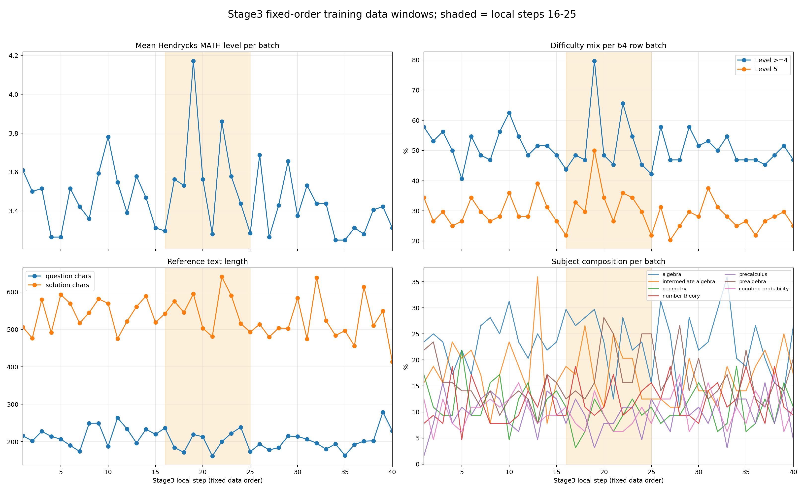
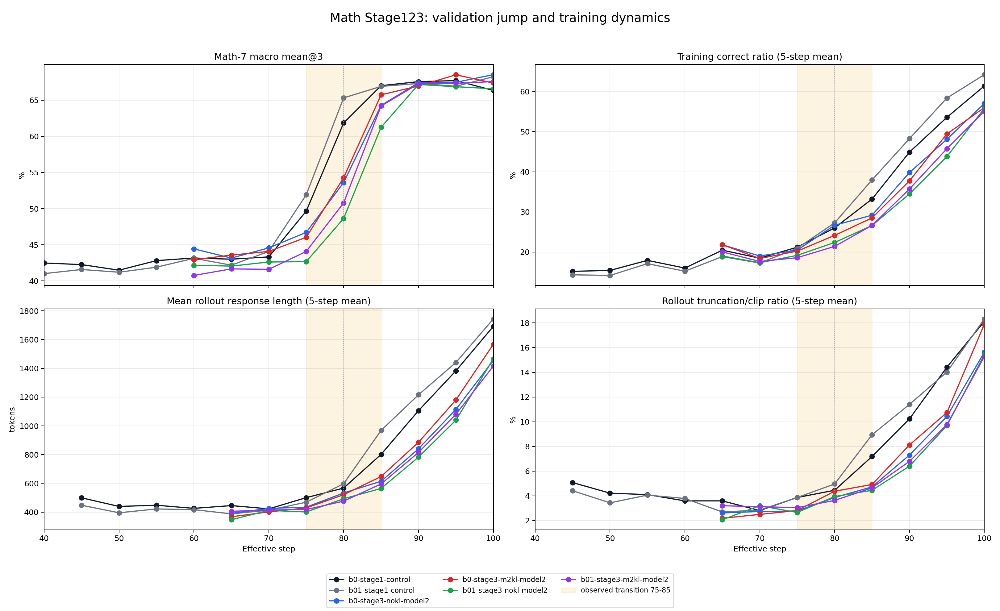
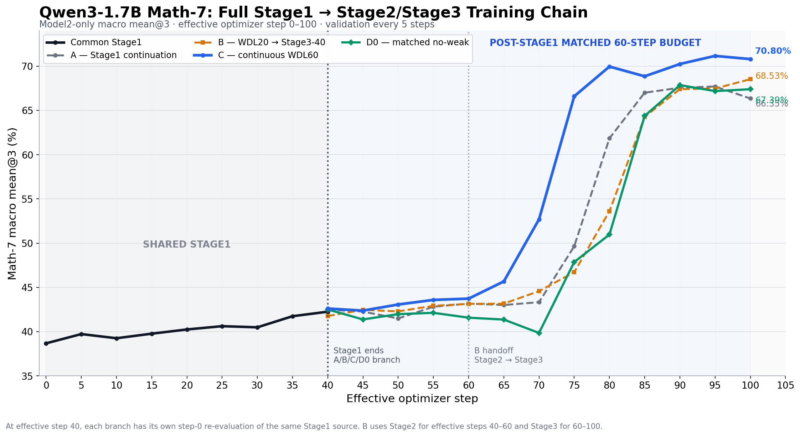
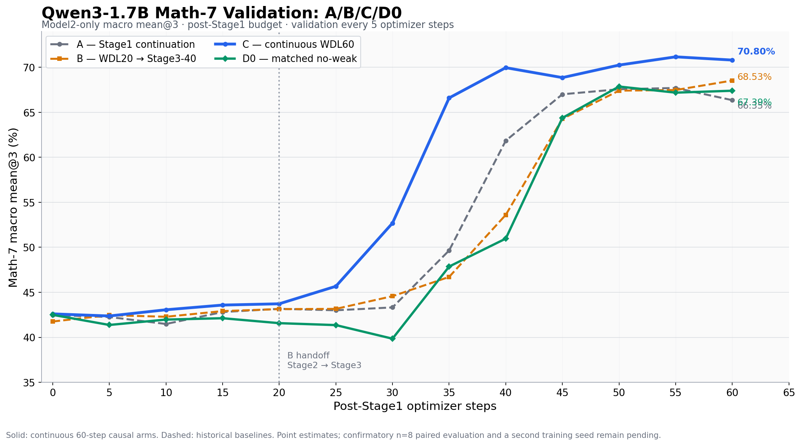
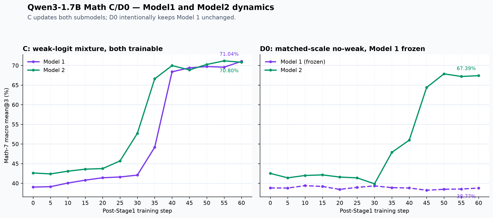

# Qwen3-1.7B 数学任务：Cold-Start、Stage123 与 WDL-first 实验结果与分析

日期：2026-07-23

实验方案：[`../plans/active/qwen3_1p7b_math_stage123.md`](../plans/active/qwen3_1p7b_math_stage123.md)

> 指标口径：`mean@3` 是每题 3 次采样的平均准确率，再对 Math-7 七个数据集做 macro average。本文 `pass@3` 从原始 validation JSONL 精确重算：每题 3 次中任意一次正确即通过，再对七个数据集做 macro average。训练日志中的 `best@3/mean` 是 1000 次 bootstrap 估计，数值接近但不完全等同于精确 pass@3。

## 0. 方案验证状态总览

| 方案问题 | 当前状态 | 已验证或未验证的原因 |
|---|---|---|
| Cold-start 能否建立 strict format contract | **已验证** | CoT-mask V3 通过真实 tokenizer loss-mask preflight 与 format admission；V1/V2 因只监督 answer/EOS 作废 |
| Stage123 16-run pipeline 是否可学习 | **已验证** | 16/16 authoritative run 完成；Stage1 control 与 Stage3 均出现清晰增长 |
| 20-step Stage2 是否足够 | **未验证 / 倾向不足** | Stage2 只改变约 `-0.44` 到 `+1.38pp`；但 joint objective 与 Stage3 single-model objective 不同，不能只从曲线认定 dose 原因 |
| Model2-only KL 是否稳定有效 | **未验证** | beta `0.0/0.1` 下方向不一致，差异小于主要 transition |
| Stage3 handoff 是否优于 matched Stage1 continuation | **未验证** | Stage3 能学习，但 matched Stage1 control 最终处于同一范围，无法归因给 WDL/handoff |
| H1: weak-logit contribution（C vs D0） | **初步支持** | strict-scorer `n=3` 点估计为 `+3.408pp mean@3`，且 7/7 数据集同向；尚缺 paired bootstrap、共同 frozen `n=8` 与第二 seed |
| H2: practical value（C vs A） | **描述性支持** | C 的历史点估计比 A 高 `+4.450pp`；A 尚未按完全相同 evaluator/generation seed 重评 |
| H3: allocation（C vs B） | **描述性支持** | C 比 B 高 `+2.272pp`；它比较 continuous WDL60 与 WDL20→Stage3-40，不是纯 Stage2-dose test |
| H4: late stability | **在线质量门禁通过，统计确认未完成** | C/D0 P60 truncation 为零且无 format-bad reward-positive；仍缺预注册 paired non-inferiority test |
| 方法级 WDL 结论 | **未确认** | 仍需共同 frozen A/B/C/D0 `n=8`、10,000 次 within-dataset paired bootstrap、第二 training seed |

## 1. 数据与运行权威性

- 设计矩阵共 16 个 run：2 个 Stage1、2 个 matched-data Stage1 control、4 个 Stage2（beta × KL）、8 个 Stage3（beta × KL × extracted model）。
- 16 个 authoritative run 均有 `stage_run_completed` 事件与最终模型；失败的早期重复 run、port-collision attempt 未纳入。
- Validation：完整 Math-7，`n=3`，每 5 step 一次；effective step 映射为 Stage1 `0–40`、Stage2 `40–60`、Stage3 `60–100`、control `40–100`。
- Stage1/2/3 的学习率均为 `1e-6`，warmup `0`。Stage2 `m2kl` 为 model2-only KL，系数 `0.01`。

## 2. 汇总表

| 实验 | Phase | beta | KL | 评测视角 | mean@3 起点→终点 | Δ mean@3 | 最佳 step/数值 | pass@3 起点→终点 | Δ pass@3 |
|---|---|---:|---|---|---:|---:|---:|---:|---:|
| `b0-stage1` | stage1 | 0 | na | model2-init | 38.67% → 42.25% | +3.58pp | 40 / 42.25% | 49.13% → 53.66% | +4.53pp |
| `b01-stage1` | stage1 | 0.1 | na | model2-init | 38.47% → 41.47% | +3.01pp | 40 / 41.47% | 49.16% → 52.36% | +3.20pp |
| `b0-stage1-control` | stage1_control | 0 | control | single | 42.48% → 66.35% | +23.87pp | 95 / 67.70% | 53.36% → 74.62% | +21.27pp |
| `b01-stage1-control` | stage1_control | 0.1 | control | single | 41.01% → 68.24% | +27.22pp | 100 / 68.24% | 52.81% → 74.33% | +21.52pp |
| `b0-stage2-nokl` | stage2 | 0 | nokl | default | 41.76% → 43.14% | +1.38pp | 60 / 43.14% | 52.68% → 54.55% | +1.88pp |
| `b0-stage2-m2kl` | stage2 | 0 | m2kl | default | 42.12% → 43.41% | +1.29pp | 60 / 43.41% | 54.26% → 55.72% | +1.47pp |
| `b01-stage2-nokl` | stage2 | 0.1 | nokl | default | 41.54% → 41.10% | -0.44pp | 55 / 41.72% | 53.76% → 53.70% | -0.07pp |
| `b01-stage2-m2kl` | stage2 | 0.1 | m2kl | default | 41.15% → 42.02% | +0.87pp | 50 / 42.04% | 52.44% → 53.36% | +0.92pp |
| `b0-stage3-nokl-model1` | stage3 | 0 | nokl | model1 | 40.98% → 57.03% | +16.05pp | 100 / 57.03% | 52.24% → 68.63% | +16.39pp |
| `b0-stage3-nokl-model2` | stage3 | 0 | nokl | model2 | 44.43% → 68.53% | +24.09pp | 100 / 68.53% | 56.55% → 76.24% | +19.68pp |
| `b0-stage3-m2kl-model1` | stage3 | 0 | m2kl | model1 | 40.06% → 52.12% | +12.06pp | 100 / 52.12% | 51.05% → 65.77% | +14.71pp |
| `b0-stage3-m2kl-model2` | stage3 | 0 | m2kl | model2 | 42.93% → 67.36% | +24.43pp | 95 / 68.51% | 54.92% → 72.55% | +17.63pp |
| `b01-stage3-nokl-model1` | stage3 | 0.1 | nokl | model1 | 39.89% → 47.34% | +7.45pp | 100 / 47.34% | 51.07% → 60.98% | +9.91pp |
| `b01-stage3-nokl-model2` | stage3 | 0.1 | nokl | model2 | 42.17% → 66.57% | +24.41pp | 90 / 67.17% | 54.76% → 74.00% | +19.24pp |
| `b01-stage3-m2kl-model1` | stage3 | 0.1 | m2kl | model1 | 40.97% → 51.24% | +10.27pp | 100 / 51.24% | 53.01% → 65.08% | +12.07pp |
| `b01-stage3-m2kl-model2` | stage3 | 0.1 | m2kl | model2 | 40.76% → 67.57% | +26.81pp | 100 / 67.57% | 52.63% → 74.60% | +21.97pp |

## 3. 每个 validation step

### `b0-stage1`

| Local step（局部步数） | Effective step（有效步数） | Math-7 mean@3 | Math-7 pass@3 |
|---:|---:|---:|---:|
| 0 | 0 | 38.67% | 49.13% |
| 5 | 5 | 39.72% | 50.76% |
| 10 | 10 | 39.25% | 49.69% |
| 15 | 15 | 39.77% | 50.67% |
| 20 | 20 | 40.24% | 51.05% |
| 25 | 25 | 40.61% | 51.90% |
| 30 | 30 | 40.48% | 51.46% |
| 35 | 35 | 41.74% | 53.23% |
| 40 | 40 | 42.25% | 53.66% |

### `b01-stage1`

| Local step（局部步数） | Effective step（有效步数） | Math-7 mean@3 | Math-7 pass@3 |
|---:|---:|---:|---:|
| 0 | 0 | 38.47% | 49.16% |
| 5 | 5 | 38.49% | 50.03% |
| 10 | 10 | 39.68% | 51.22% |
| 15 | 15 | 39.79% | 50.36% |
| 20 | 20 | 39.94% | 51.71% |
| 25 | 25 | 39.96% | 50.61% |
| 30 | 30 | 40.01% | 51.36% |
| 35 | 35 | 41.12% | 53.19% |
| 40 | 40 | 41.47% | 52.36% |

### `b0-stage1-control`

| Local step（局部步数） | Effective step（有效步数） | Math-7 mean@3 | Math-7 pass@3 |
|---:|---:|---:|---:|
| 0 | 40 | 42.48% | 53.36% |
| 5 | 45 | 42.26% | 54.21% |
| 10 | 50 | 41.48% | 52.74% |
| 15 | 55 | 42.81% | 53.85% |
| 20 | 60 | 43.17% | 54.68% |
| 25 | 65 | 43.00% | 54.94% |
| 30 | 70 | 43.32% | 54.76% |
| 35 | 75 | 49.65% | 63.51% |
| 40 | 80 | 61.84% | 70.85% |
| 45 | 85 | 67.00% | 73.51% |
| 50 | 90 | 67.56% | 74.11% |
| 55 | 95 | 67.70% | 74.94% |
| 60 | 100 | 66.35% | 74.62% |

### `b01-stage1-control`

| Local step（局部步数） | Effective step（有效步数） | Math-7 mean@3 | Math-7 pass@3 |
|---:|---:|---:|---:|
| 0 | 40 | 41.01% | 52.81% |
| 5 | 45 | 41.58% | 54.35% |
| 10 | 50 | 41.20% | 52.33% |
| 15 | 55 | 41.90% | 53.91% |
| 20 | 60 | 43.13% | 55.32% |
| 25 | 65 | 42.18% | 54.33% |
| 30 | 70 | 44.07% | 56.89% |
| 35 | 75 | 51.90% | 64.56% |
| 40 | 80 | 65.32% | 74.60% |
| 45 | 85 | 66.90% | 73.75% |
| 50 | 90 | 67.31% | 75.07% |
| 55 | 95 | 66.92% | 75.00% |
| 60 | 100 | 68.24% | 74.33% |

### `b0-stage2-nokl`

| Local step（局部步数） | Effective step（有效步数） | Math-7 mean@3 | Math-7 pass@3 |
|---:|---:|---:|---:|
| 0 | 40 | 41.76% | 52.68% |
| 5 | 45 | 42.46% | 52.95% |
| 10 | 50 | 42.28% | 53.02% |
| 15 | 55 | 42.92% | 53.94% |
| 20 | 60 | 43.14% | 54.55% |

### `b0-stage2-m2kl`

| Local step（局部步数） | Effective step（有效步数） | Math-7 mean@3 | Math-7 pass@3 |
|---:|---:|---:|---:|
| 0 | 40 | 42.12% | 54.26% |
| 5 | 45 | 41.16% | 52.77% |
| 10 | 50 | 42.27% | 53.00% |
| 15 | 55 | 42.58% | 53.97% |
| 20 | 60 | 43.41% | 55.72% |

### `b01-stage2-nokl`

| Local step（局部步数） | Effective step（有效步数） | Math-7 mean@3 | Math-7 pass@3 |
|---:|---:|---:|---:|
| 0 | 40 | 41.54% | 53.76% |
| 5 | 45 | 41.31% | 53.10% |
| 10 | 50 | 41.46% | 52.20% |
| 15 | 55 | 41.72% | 54.10% |
| 20 | 60 | 41.10% | 53.70% |

### `b01-stage2-m2kl`

| Local step（局部步数） | Effective step（有效步数） | Math-7 mean@3 | Math-7 pass@3 |
|---:|---:|---:|---:|
| 0 | 40 | 41.15% | 52.44% |
| 5 | 45 | 41.70% | 54.14% |
| 10 | 50 | 42.04% | 54.54% |
| 15 | 55 | 41.51% | 53.61% |
| 20 | 60 | 42.02% | 53.36% |

### `b0-stage3-nokl-model1`

| Local step（局部步数） | Effective step（有效步数） | Math-7 mean@3 | Math-7 pass@3 |
|---:|---:|---:|---:|
| 0 | 60 | 40.98% | 52.24% |
| 5 | 65 | 41.30% | 53.40% |
| 10 | 70 | 41.56% | 52.70% |
| 15 | 75 | 41.55% | 54.20% |
| 20 | 80 | 41.87% | 53.30% |
| 25 | 85 | 41.85% | 53.54% |
| 30 | 90 | 42.20% | 54.73% |
| 35 | 95 | 45.59% | 58.54% |
| 40 | 100 | 57.03% | 68.63% |

### `b0-stage3-nokl-model2`

| Local step（局部步数） | Effective step（有效步数） | Math-7 mean@3 | Math-7 pass@3 |
|---:|---:|---:|---:|
| 0 | 60 | 44.43% | 56.55% |
| 5 | 65 | 43.16% | 55.41% |
| 10 | 70 | 44.57% | 57.09% |
| 15 | 75 | 46.71% | 59.24% |
| 20 | 80 | 53.60% | 66.45% |
| 25 | 85 | 64.27% | 73.04% |
| 30 | 90 | 67.40% | 74.51% |
| 35 | 95 | 67.47% | 75.47% |
| 40 | 100 | 68.53% | 76.24% |

### `b0-stage3-m2kl-model1`

| Local step（局部步数） | Effective step（有效步数） | Math-7 mean@3 | Math-7 pass@3 |
|---:|---:|---:|---:|
| 0 | 60 | 40.06% | 51.05% |
| 5 | 65 | 41.18% | 52.92% |
| 10 | 70 | 40.48% | 51.94% |
| 15 | 75 | 41.05% | 52.94% |
| 20 | 80 | 41.80% | 53.37% |
| 25 | 85 | 42.44% | 53.86% |
| 30 | 90 | 41.38% | 53.00% |
| 35 | 95 | 43.86% | 57.09% |
| 40 | 100 | 52.12% | 65.77% |

### `b0-stage3-m2kl-model2`

| Local step（局部步数） | Effective step（有效步数） | Math-7 mean@3 | Math-7 pass@3 |
|---:|---:|---:|---:|
| 0 | 60 | 42.93% | 54.92% |
| 5 | 65 | 43.57% | 55.74% |
| 10 | 70 | 44.08% | 57.51% |
| 15 | 75 | 46.03% | 59.10% |
| 20 | 80 | 54.27% | 66.01% |
| 25 | 85 | 65.74% | 73.88% |
| 30 | 90 | 66.96% | 72.74% |
| 35 | 95 | 68.51% | 75.87% |
| 40 | 100 | 67.36% | 72.55% |

### `b01-stage3-nokl-model1`

| Local step（局部步数） | Effective step（有效步数） | Math-7 mean@3 | Math-7 pass@3 |
|---:|---:|---:|---:|
| 0 | 60 | 39.89% | 51.07% |
| 5 | 65 | 39.72% | 51.02% |
| 10 | 70 | 40.21% | 51.94% |
| 15 | 75 | 40.66% | 52.05% |
| 20 | 80 | 41.49% | 53.68% |
| 25 | 85 | 41.58% | 54.16% |
| 30 | 90 | 40.14% | 52.14% |
| 35 | 95 | 42.04% | 54.45% |
| 40 | 100 | 47.34% | 60.98% |

### `b01-stage3-nokl-model2`

| Local step（局部步数） | Effective step（有效步数） | Math-7 mean@3 | Math-7 pass@3 |
|---:|---:|---:|---:|
| 0 | 60 | 42.17% | 54.76% |
| 5 | 65 | 42.05% | 54.66% |
| 10 | 70 | 42.62% | 55.87% |
| 15 | 75 | 42.67% | 55.95% |
| 20 | 80 | 48.64% | 62.55% |
| 25 | 85 | 61.25% | 71.42% |
| 30 | 90 | 67.17% | 74.17% |
| 35 | 95 | 66.86% | 74.70% |
| 40 | 100 | 66.57% | 74.00% |

### `b01-stage3-m2kl-model1`

| Local step（局部步数） | Effective step（有效步数） | Math-7 mean@3 | Math-7 pass@3 |
|---:|---:|---:|---:|
| 0 | 60 | 40.97% | 53.01% |
| 5 | 65 | 39.45% | 51.01% |
| 10 | 70 | 40.46% | 51.95% |
| 15 | 75 | 39.46% | 51.22% |
| 20 | 80 | 40.11% | 51.62% |
| 25 | 85 | 40.91% | 53.40% |
| 30 | 90 | 40.73% | 54.35% |
| 35 | 95 | 42.83% | 55.41% |
| 40 | 100 | 51.24% | 65.08% |

### `b01-stage3-m2kl-model2`

| Local step（局部步数） | Effective step（有效步数） | Math-7 mean@3 | Math-7 pass@3 |
|---:|---:|---:|---:|
| 0 | 60 | 40.76% | 52.63% |
| 5 | 65 | 41.67% | 54.48% |
| 10 | 70 | 41.61% | 54.84% |
| 15 | 75 | 44.07% | 57.09% |
| 20 | 80 | 50.79% | 64.33% |
| 25 | 85 | 64.20% | 74.41% |
| 30 | 90 | 67.26% | 74.17% |
| 35 | 95 | 67.32% | 74.33% |
| 40 | 100 | 67.57% | 74.60% |

## 4. Stage3 model2 分数据集结果

### `b0-stage3-nokl-model2`

| 数据集 | Stage3 前 | Stage3 后 | Δ mean@3 |
|---|---:|---:|---:|
| AIME-2025 | 1.28% | 17.95% | +16.67pp |
| MATH-500 | 34.68% | 71.17% | +36.49pp |
| GSM8K | 54.26% | 81.91% | +27.65pp |
| AQUA-RAT | 43.44% | 75.98% | +32.55pp |
| SVAMP | 74.67% | 89.44% | +14.78pp |
| MAWPS | 87.70% | 92.39% | +4.69pp |
| AMC23 | 15.00% | 50.83% | +35.83pp |

### `b0-stage3-m2kl-model2`

| 数据集 | Stage3 前 | Stage3 后 | Δ mean@3 |
|---|---:|---:|---:|
| AIME-2025 | 1.28% | 12.82% | +11.54pp |
| MATH-500 | 33.33% | 67.81% | +34.48pp |
| GSM8K | 51.76% | 82.39% | +30.63pp |
| AQUA-RAT | 38.06% | 76.25% | +38.19pp |
| SVAMP | 74.78% | 91.33% | +16.56pp |
| MAWPS | 87.98% | 92.58% | +4.60pp |
| AMC23 | 13.33% | 48.33% | +35.00pp |

### `b01-stage3-nokl-model2`

| 数据集 | Stage3 前 | Stage3 后 | Δ mean@3 |
|---|---:|---:|---:|
| AIME-2025 | 1.28% | 12.82% | +11.54pp |
| MATH-500 | 32.19% | 69.09% | +36.90pp |
| GSM8K | 49.68% | 81.68% | +31.99pp |
| AQUA-RAT | 38.71% | 75.33% | +36.61pp |
| SVAMP | 72.11% | 90.33% | +18.22pp |
| MAWPS | 84.51% | 92.58% | +8.08pp |
| AMC23 | 16.67% | 44.17% | +27.50pp |

### `b01-stage3-m2kl-model2`

| 数据集 | Stage3 前 | Stage3 后 | Δ mean@3 |
|---|---:|---:|---:|
| AIME-2025 | 0.00% | 14.10% | +14.10pp |
| MATH-500 | 32.93% | 69.62% | +36.69pp |
| GSM8K | 48.45% | 82.41% | +33.97pp |
| AQUA-RAT | 36.35% | 75.98% | +39.63pp |
| SVAMP | 70.56% | 90.22% | +19.67pp |
| MAWPS | 87.04% | 93.15% | +6.10pp |
| AMC23 | 10.00% | 47.50% | +37.50pp |

## 5. 结论

### 得到支持的结论

1. **修复后的 CoT-v3 训练链路确实能学习。** Stage1 只有约 `+3pp`，但 control 和所有 Stage3 分支都出现明确增长；Stage3 model2 的训练 correct ratio 也随训练上升，排除了“只有 validation 偶然波动”的解释。
2. **Stage3 对 extracted model2 的增益稳定且普遍。** 四条 model2 Stage3 最终 mean@3 增益为 `+24.09pp`、`+24.43pp`、`+24.41pp`、`+26.81pp`；七个数据集均增长，不是单个数据集拉动。
3. **增长存在清晰的 phase transition。** model2 在 Stage3 local step `0–15` 基本平缓，主要跃升集中在 local step `20–30`；最大单个 5-step 增量出现在 step `20→25`，约 `+10.67` 到 `+13.40pp`。因此不是一开始即持续线性增长，也不是最后一点偶然跳变。
4. **model2 明显比 model1 更容易从 Stage3 获益。** model1 最终增益为 `+7.45` 到 `+16.05pp`，显著低于 model2 的 `+24.09` 到 `+26.81pp`。Stage2 联合训练后两个 extracted submodel 的可学习性并不对称。
5. **Stage2 20-step 预算偏短。** 四条 Stage2 final mean@3 变化仅 `+1.38pp`、`+1.29pp`、`-0.44pp`、`+0.87pp`；曲线尚未进入 Stage3 在 local step 20–30 出现的跃升区间。

### 被否定或未得到支持的结论

1. **“三阶段 WDL 路径在 matched 100-step budget 下优于继续 Stage1”没有得到证明。** Stage1 control 在 effective step 100 达到 `66.35%/68.24%` mean@3；Stage3 model2 final 为 `66.57–68.53%`，整体相当而非稳定领先。最好的 staged final `68.53%` 只比对应 beta=0 control final `66.35%` 高 `2.18pp`，但 control 自身 best 为 `67.70%`，差距缩至 `0.83pp`；beta=0.1 control final `68.24%` 反而高于两个 staged final。当前证据只能说明 staged path 可达到 control 水平，不能归因出 WDL 本身的独立优势。
2. **“model2-only KL 稳定有效”没有得到支持。** Stage2 m2kl 相比 nokl 仅有小且不一致的差异；Stage3 model2 中 beta=0 的 KL/no-KL final 基本持平（KL 略低），beta=0.1 的 KL 略高。没有跨 beta 的一致优势。
3. **“beta=0.1 会阻止 Stage3 大幅增长”被本轮完整结果否定。** beta=0.1 的两条 model2 Stage3 同样增长 `+24.41pp/+26.81pp`，与 beta=0 一致甚至略高。此前只看中途 step 得出的“没有复现大跳”是 premature conclusion，因为跃升主要发生在 local step 20–30。
4. **“beta=0.1 优于 beta=0”也没有成立。** beta=0.1 在 model2 上不破坏学习，但 final 与 beta=0 互有胜负；在 model1 上，nokl 分支 beta=0.1 明显更弱。reverse-SFT 的总体收益仍不确定。

### 实验设计中仍无法回答的问题

1. **WDL 的因果增益没有被纯净隔离。** control 是继续单模型 Stage1，treatment 中间经过 joint Stage2、submodel extraction，再单模型 Stage3；二者结构不同。要验证 WDL，需要增加 matched 初始化/数据/step 的 no-WDL Stage2→Stage3 或 single-model loss ablation。
2. **Stage2 是否只差训练步数仍需延长实验。** 当前证据强烈提示 20 steps 太短，但不能保证延长到 30/40 一定复现 Stage3 跃升，因为 Stage2 使用 joint model2-rollout/fused-loss，Stage3 使用 extracted single model，优化几何不同。
3. **单次 seed 不能确认 KL 或 beta 的小差异。** 大幅跃升是 robust signal；`1–3pp` 的差异仍需多 seed 或独立 offline eval。

## 6. 产物

- [`data/qwen3_1p7b_math_stage123_all_validation_steps.csv`](data/qwen3_1p7b_math_stage123_all_validation_steps.csv)：16 个实验的所有 validation step。
- [`data/qwen3_1p7b_math_stage123_all_validation_steps_by_dataset.csv`](data/qwen3_1p7b_math_stage123_all_validation_steps_by_dataset.csv)：逐数据集、逐 step 指标。
- [`data/qwen3_1p7b_math_stage123_experiment_summary.csv`](data/qwen3_1p7b_math_stage123_experiment_summary.csv)：实验汇总。
- [`figures/qwen3_1p7b_math_stage123_effective_step_mean3.png`](figures/qwen3_1p7b_math_stage123_effective_step_mean3.png)：mean@3 合并曲线。
- [`figures/qwen3_1p7b_math_stage123_effective_step_pass3.png`](figures/qwen3_1p7b_math_stage123_effective_step_pass3.png)：精确 pass@3 合并曲线。
- [`figures/qwen3_1p7b_math_stage123_final_mean3_comparison.png`](figures/qwen3_1p7b_math_stage123_final_mean3_comparison.png)：effective step 100 final 对比。

## 6.1 发布状态

- Deterministic training release gate：`16/16` 个 authoritative run 均以
  `success_complete` 通过。
- 本地 experiment registry：已导入
  `/data-1/experiment_registry/experiment_registry.sqlite`，training-run ID
  为 `80–95`。
- W&B offline run：Math project 下的 `16/16` 个 run 均已定位，并映射到预期的
  remote run ID。
- W&B cloud sync：**等待中**。当前环境没有提供 `WANDB_API_KEY`，因此尚无
  `.synced` marker，也没有经过验证的 cloud run。
- 没有上传 checkpoint 或 model artifact payload。

Release 证据：
`/data-1/tmp/verl_agent_scratch/math_stage123_release_20260723/release_summary.json`.

## 7. 固定顺序训练数据分析

### 7.1 问题

Stage1 control 和 Stage3 model2 run 的 validation 跃升都出现在 effective step
`75–85` 附近。由于 dataset permutation 和 row order 已冻结，一个合理的替代解释是：
对应训练行异常有用，而不是 optimizer 跨过了由 step 决定的阈值。

相关 fixed-order window 如下：

| Effective window | Stage1 control local step | Stage3 local step | Source row |
|---|---:|---:|---|
| `61–70` | `21–30` | `1–10` | Stage3 rows `0–639` |
| `71–75` | `31–35` | `11–15` | Stage3 rows `640–959` |
| `76–80` | `36–40` | `16–20` | Stage3 rows `960–1279` |
| `81–85` | `41–45` | `21–25` | Stage3 rows `1280–1599` |
| `86–90` | `46–50` | `26–30` | Stage3 rows `1600–1919` |

### 7.2 描述性结果

根据 Hendrycks MATH 可用的 metadata，Stage3 local `16–25` 对应的数据没有构成一个
明显的单独 outlier：

| Window | 平均难度等级 | Level >=4 | Level 5 | 平均题目字符数 | 平均 reference solution 字符数 |
|---|---:|---:|---:|---:|---:|
| Stage3 `11–15` | 3.46 | 50.94% | 30.63% | 229.41 | 532.84 |
| Stage3 `16–20` | 3.63 | 53.44% | 33.75% | 204.92 | 551.91 |
| Stage3 `21–25` | 3.49 | 50.63% | 29.69% | 199.19 | 543.83 |
| Stage3 `26–30` | 3.48 | 52.19% | 26.88% | 196.78 | 516.49 |

Local step `16–20` 的数据稍难，但四条 Stage3 model2 run 中 validation 跃升最大的
local step `21–25`，与相邻窗口相比并不更难、更长，也没有更集中于某一 subject。
Subject mix 会随 batch 波动，但不存在与跃升匹配的唯一共同 spike。

Stage3 只有八个 5-step window，因此相关性只作探索。平均难度等级与四模型平均
validation delta 的 Spearman correlation 为 `0.79`，但 Pearson correlation 只有
`0.52`，`p=0.19`；其他简单 metadata feature 也没有显示稳定关系。这些证据不足以把
跃升归因于数据难度或 subject composition。

结构化证据：

- [`data/qwen3_1p7b_math_stage123_training_data_step_features.csv`](data/qwen3_1p7b_math_stage123_training_data_step_features.csv)
- [`data/qwen3_1p7b_math_stage123_training_data_window_features.csv`](data/qwen3_1p7b_math_stage123_training_data_window_features.csv)
- [`data/qwen3_1p7b_math_stage123_stage3_data_metric_join.csv`](data/qwen3_1p7b_math_stage123_stage3_data_metric_join.csv)

### 7.3 当前解释

固定数据顺序仍是现实存在的 confounder，但描述性证据**没有**找到能够解释跃升的特殊
row block。当前更强的假设是：模型在处理这些数据行期间跨过了 optimization/state
threshold。要进行因果分离，仍需 data-order intervention。

### 7.4 2026-07-27 D0 在线复核：数据窗口解释未获支持

本节补充正在运行的 matched-scale no-weak control `D0` 的中期证据；它用于解释
跃升机制，不作为 `D0` 或后续 Arm C 的最终 efficacy 结论。`D0` 从完成 40 steps
的 `b0-stage1` Model2 初始化，因此 local step `35` 对应 effective step `75`。
它在 effective `70 -> 75` 的 Math-7 macro mean@3 从 `40.11%` 升至
`48.43%`，增加 `8.32pp`。此前 `b0-stage1-control` 和
`b01-stage1-control` 在同一区间分别增加 `6.33pp` 和 `7.83pp`。从 `D0`
step-40 原始 validation JSONL 直接重算的 effective-step-80 mean@3 为
`51.88%`，说明 step 35 不是立即回落的孤立 validation 点，但 `D0` 仍在运行，
最终比较必须等待预注册终点。

对 effective `71–75` 对应的 combined parquet rows `1920–2239`（Stage3
source rows `640–959`）重新审计后，没有发现数据源、schema、prompt、reward
style 或 shard 边界发生变化。真正的 Stage2-to-Stage3 shard 边界位于 effective
step `60 -> 61`；effective step `75` 只是同一 Stage3 shard 内的普通位置。

| Effective window | 平均难度等级 | Level >=4 | 平均题目字符数 | 平均 reference solution 字符数 |
|---|---:|---:|---:|---:|
| `66–70` | 3.53 | 53.8% | 210 | 556 |
| `71–75` | 3.46 | 50.9% | 229 | 533 |
| `76–80` | 3.63 | 53.4% | 205 | 552 |
| `81–85` | 3.49 | 50.6% | 199 | 544 |
| 全部 3,840 rows | 3.50 | 52.7% | 207 | 544 |

该窗口只表现为题目文字略长、标注难度略低，reference solution 长度、subject
mix，以及 numeric、fraction、expression 三类答案比例均与相邻窗口和全量数据
接近。3,840 个 source index 全部唯一，没有重复训练题；对规范化题面做 exact
match，也没有发现训练数据与 Math-7 的 2,797 个 unique validation prompts
重叠。静态特征因此不支持“effective `71–75` 恰好是一批显著更优质训练数据”
作为跃升的主要解释。

实际训练信号同样没有显示该窗口是孤立的 easy/high-reward batch。两个 Stage1
controls 在 local steps `31–35` 的平均 rollout correct ratio 分别只有 `21.2%`
和 `20.9%`；四条历史 Stage3 Model2 路径处理相同 source rows 时为
`18.6–20.5%`。当前 `D0` 在该窗口为 `30.9%`，随后 local steps `36–40`
继续升至约 `39.6%`，同时平均 response length 从 `391` tokens 增至约 `511`
tokens。变化更像跨多个相邻窗口持续展开的模型状态转变，而不是单批数据触发的
一次性奖励脉冲。

当前更可能的机制是：随着累计优化进入 transition regime，正确 rollout 比例
上升，使 `beta=0.0` 的 positive-only WDL/SFT objective 获得更多可监督 response
和 token；同时回答从偏短、推理不足进入更合适的长度区间，从而提高每步有效
梯度信号的密度与质量。correct ratio、positive supervised token count、response
length、grad norm 和 held-out accuracy 的同步变化支持这一解释。不过这仍是机制
假设，不是严格因果证明；回答继续变长也可能最终带来 truncation，不能把长度
上升本身当成质量提升。

因此，本轮复核否定的是“现有证据显示跃升区间的数据本身更优质”这一具体疑问，
而不是数学上排除任何 data-order effect。由于 fixed row order 与 effective step
仍然绑定，最终区分数据窗口和优化阈值仍需要 deterministic reshuffle 或 window
relocation intervention。

## 8. 训练指标分析

### 8.1 共同的 transition 特征

两个 Stage1 control 和四个 Stage3 model2 run 都呈现以下特征：

1. effective step `75` 前，Math-7 基本保持在 `41–47%`；
2. training correct ratio 在 effective step `75–80` 左右开始持续上升；
3. effective step `80–90` 期间，平均 rollout response length 从约 `400–500` token
   上升到 `600–1,000+` token；
4. validation accuracy 在同一区间上升；
5. truncation/clip ratio 也随之上升，到 effective step `100` 时约为 `15–18%`。

在六条 control/model2 曲线上，validation level 与 training correct ratio 高度相关
（`Pearson r=0.86`，`Spearman r=0.92`），与 rollout length 也高度相关
（`Pearson r=0.81`，`Spearman r=0.89`）。这些是 trajectory correlation，不能确定
因果方向；但它们表明跃升伴随真实的 rollout behavior 变化，而不只是 validation noise。

### 8.2 安全性解释

本轮实验中，更长的 response 与更好的 validation accuracy 相关，但持续上升的 truncation
rate 表明这并非没有代价的提升。Continuation 实验必须监测：

- Math-7 macro `mean@3` 和精确 `pass@3`；
- `wdl_sft/correct_ratio` 与 reward mean；
- response-length mean 与 distribution；
- response clip/truncation ratio 与 EOS rate；
- grad norm 和 policy/loss 指标；
- format completeness 与 boxed extraction。

不能仅凭 reward 和 response length 上升就宣布 run 更好。主结果仍是 Math-7 accuracy，
truncation 与 format 指标作为 hard health check。

结构化证据：

- [`data/qwen3_1p7b_math_stage123_training_history.csv`](data/qwen3_1p7b_math_stage123_training_history.csv)
- [`data/qwen3_1p7b_math_stage123_training_metric_correlations.csv`](data/qwen3_1p7b_math_stage123_training_metric_correlations.csv)

## 9. 更新后的结论

1. CoT-v3 训练链路健康，所有 treatment/control path 都能学习。
2. Stage3 model2 的大幅增益真实存在，覆盖多个数据集，并在 beta `0.0` 和 `0.1` 下复现。
3. 跃升集中在 effective step `75–85` 附近，pure Stage1 control 也在同一时段出现。因此，
   该跃升**本身不能证明** WDL、joint Stage2 或 handoff 具有优势。
4. 没有任何简单的 Stage3 data-window feature 能唯一解释跃升。固定顺序仍是 confounder，
   必须通过受控的数据重排来检验。
5. transition 伴随 correct ratio、response length 上升，并最终伴随 truncation 上升。
   模型改变了 rollout regime，而不只是落在 validation noise 内波动。
6. 在已完成矩阵中，Model2-only KL 没有稳定优势。
7. matched-budget control 阻止我们对 staged WDL design 作正面因果声明。仍需增加 matched
   loss 与 data-order ablation。

## 10. 后续实验问题

关联的实验方案已经预注册 continuation matrix，主要问题是：

1. Stage2 超过 local step `20` 后，是否进入同样的 transition？
2. 当 Stage2 使用相同 canonical data order 时，transition 是否仍绑定 effective step
   `75–85`？
3. 移动或 shuffle 疑似相关的 Stage3 row window，是否会移动 transition？
4. Stage2 总 step 为 `40`、`45`、`60` 时，哪个 checkpoint 能提供最好的 Stage3 handoff？
5. 能否在不让 response length 和 truncation 持续上升的情况下保留增益？

## 11. Cold-start 结果与无效 lineage

原始 Qwen3-1.7B 的 Step-0 Math-7 `n=1` strict complete-format 只有 `44.4%`，主要问题包括
缺少 boxed answer、tag 不完整和竞赛题截断，因此不能直接作为 Stage123 Model1。V1/V2
cold-start 又因逐轮渲染 assistant message，实际 loss mask 只监督 answer/EOS；两者 checkpoint
与结果全部作废。

CoT-mask V3 改为 whole-message tokenization，完整监督 reasoning、answer 和 EOS，并通过真实
tokenizer regression test、1,100 行 preflight 和最早-passing-checkpoint selection。由此验证的
是格式准入链路，而不是 WDL capability。

## 12. WDL-first causal P60 strict-scorer 结果

首轮 D0/C runtime 解析到 permissive scorer，允许缺少 `<answer>` 的 boxed response 获得正分，
同时污染 validation 与训练 positive set，因此旧 D0 `69.84%`、C `70.66%` 只作 invalidated
local diagnostic evidence。以下只报告 strict scorer 修复后从同一 Stage1 source 重跑的结果。

### 12.1 Stage1 -> Stage2/Stage3 完整训练链路

下图使用 effective optimizer step `0–100`：所有 arm 先共享 `b0-stage1` 的 step `0–40`，
随后在 effective step 40 分叉。A 继续单模型训练；B 在 effective step `40–60` 运行 Stage2、
在 `60–100` 运行 Stage3；C/D0 在 `40–100` 连续运行 60-step WDL/no-weak treatment。
effective step 40 的四个分支点是同一 Stage1 source 的独立 P0 重评，因此与 Stage1 P40 会有
小幅 sampling 波动，不代表中间发生了额外训练。

这张图用于回答“完整训练链最后哪条路线更好”；下一张 post-Stage1 zoom 则专门放大四种
60-step allocation/treatment 的差异。完整绘图数据见
[`assets/qwen3_1p7b_math_wdl_full_chain_curves.csv`](assets/qwen3_1p7b_math_wdl_full_chain_curves.csv)。

### 12.2 Post-Stage1 60-step validation 放大图

四个 arm 按 Stage1 之后的 optimizer step 对齐，横轴均为 `0–60`，纵轴为 Model2-only
Math-7 macro `mean@3`。B 使用真实的 staged chain：step `0–20` 来自 Stage2 no-KL，
step `25–60` 来自 extracted Model2 的 Stage3；图中虚线标出了 step 20 handoff。

| Post-Stage1 step | A: Stage1 continuation | B: WDL20 -> Stage3-40 | C: continuous WDL60 | D0: matched no-weak |
|---:|---:|---:|---:|---:|
| 0 | 42.48% | 41.76% | 42.60% | 42.50% |
| 5 | 42.26% | 42.46% | 42.37% | 41.37% |
| 10 | 41.48% | 42.28% | 43.06% | 41.97% |
| 15 | 42.81% | 42.92% | 43.58% | 42.12% |
| 20 | 43.17% | 43.14% | 43.73% | 41.57% |
| 25 | 43.00% | 43.16% | 45.67% | 41.36% |
| 30 | 43.32% | 44.57% | 52.69% | 39.85% |
| 35 | 49.65% | 46.71% | 66.59% | 47.86% |
| 40 | 61.84% | 53.60% | 69.96% | 50.97% |
| 45 | 67.00% | 64.27% | 68.85% | 64.37% |
| 50 | 67.56% | 67.40% | 70.24% | 67.86% |
| 55 | 67.70% | 67.47% | **71.16%** | 67.18% |
| 60 | 66.35% | 68.53% | **70.80%** | 67.39% |

曲线提供了比 P60 endpoint 更强的描述性证据：C 不是只在最后一个 validation 点偶然领先，
而是从 step 25 开始更早进入增长区间，并在 step 40–60 的五个 validation 点持续处于最高或
并列最高水平。C 在 step 55 达到 `71.16%`，P60 仍保持 `70.80%`；当前没有 late collapse
迹象。D0 最终追上 A/B 的水平，但启动增长更晚，说明 continuous 60-step training 本身有效，
同时 C 相对 D0 的提前增长与最终差距支持 weak-logit contribution。

**方法状态调整：**从本轮后续实验开始，C（continuous WDL60）作为主方法候选和默认 treatment；
B（WDL20 -> Stage3-40）降级为 legacy staged baseline，只保留用于历史比较，不再作为新实验的
默认训练路径。共同 frozen `n=8`、paired bootstrap 与第二 training seed 通过后，才把 B 从
confirmatory 主矩阵中正式移除。原始数据见
[`assets/qwen3_1p7b_math_wdl_p60_ablation_curves.csv`](assets/qwen3_1p7b_math_wdl_p60_ablation_curves.csv)。

### 12.3 P60 endpoint 与主比较

| Arm | 配置 | Math-7 mean@3 | Exact pass@3 |
|---|---|---:|---:|
| A | Stage1 continuation 60 | 66.35% | 74.62% |
| B | WDL20 -> Stage3-40 | 68.53% | 76.24% |
| D0 | continuous no-weak；$0.8z_2$ | 67.394% | 75.323% |
| C | continuous WDL60；$0.2z_1+0.8z_2$ | **70.802%** | **77.407%** |

主要 delta：

- C - D0：`+3.408pp mean@3`、`+2.084pp pass@3`；这是 H1 的 matched-scale 主比较；
- C - A：`+4.450pp mean@3`、`+2.786pp pass@3`；A 尚未共同 frozen 重评，只作描述；
- C - B：`+2.272pp mean@3`、`+1.166pp pass@3`；只说明 allocation 差异；
- D0 - A：`+1.044pp mean@3`，不支持“joint wrapper 本身解释全部 C 增益”。

C 在七个 Math 数据集的 mean@3 上全部高于 D0。D0/C P60 complete-format 分别为
`96.571%/95.579%`；两者 truncation、format-bad reward-positive 和 missing-answer
reward-positive 均为零。因此 strict-scorer 重跑消除了旧结果的格式虚高。

当前结论是：在这一 training seed 和在线 `n=3` 点评测下，H1 得到初步支持，H2/H3 得到
描述性支持。由于尚未完成共同 frozen A/B/C/D0 `n=8`、10,000 次 within-dataset stratified
paired bootstrap 和第二 training seed，不能称为统计显著或已确认的方法级 WDL 胜利。

### 12.4 Standard GRPO effective P200 follow-up（2026-08-14）

| GRPO arm | actual / effective endpoint | latest Math-7 mean@3 | peak Math-7 mean@3 | 状态 |
|---|---|---:|---:|---|
| Cold Start，LR `1e-6`（Job 68） | P198 / ≈P200 | P195：68.54% | P160：68.82% | exit 0；gate BLOCKED |
| Stage1，LR `1e-6`（Job 72） | local P160 / effective P200 | P160：68.37% | local P155：68.90% | artifact complete；gate BLOCKED |
| Cold Start，LR `5e-7`（Job 73） | P198 / ≈P200 | P195：50.70% | P195：50.70% | exit 0；gate BLOCKED |
| Stage1，LR `5e-7`（Job 74） | receipt snapshot local P99 / effective P139 | P95：46.95% | P90：47.06% | running；gate BLOCKED |

P198 的来源已经定位：6,400 个 raw prompt 在长度过滤后剩 6,324 行，每轮为 98 个完整 batch；
resume 未恢复 dataloader cursor，trainer 又用本地 global step 除以 98 推断当前 epoch。Cold Start
从 P100 恢复时只剩一个 98-step epoch，Stage1 从 local P60 恢复则仍有足够 epoch 被 hard cap 截到
P160。因而这是 resume/epoch bookkeeping 缺陷，不是 prompt 或 evaluator 不一致。

预算分析把 P198 记为 effective ≈P200 是可接受的 1% 近似，但 source-backed 记录仍以 actual P198、
latest validated P195 为准。当前最佳 GRPO peak 68.90%，低于 C peak 71.16% 约 2.26 pp；Job 72
terminal 68.37%，低于 C P60 70.80% 约 2.43 pp。LR `1e-6` 的两种初始化最终峰值近似，而
LR `5e-7` Cold Start 明显较弱，表明 GRPO 对 LR 敏感。

这批结果支持“WDL C 在当前 seed、在线 n=3 和扩展到约两个 epoch 的 GRPO budget 下仍更快且
endpoint 更高”，但不能证明 WDL 最终 ceiling 更高，也不能把 effective steps 当作精确 compute。
Job 74、共同冻结 offline pass@k 和多 seed 仍未完成；四个 GRPO run 的 release gate 当前均未通过，
因此本节是本地 provisional result，不是 DB/W&B 正式发布。

### 12.5 Compute budget 摘要（完整审计见附录 A）

本节把 effective step proxy 进一步展开为 source-backed compute 估算。统一入口：
`docs/joint_training/reports/scripts/plot_qwen3_1p7b_math_grpo_wdl_results.py`；CSV：
`docs/joint_training/reports/data/qwen3_1p7b_math_grpo_wdl_budget_estimate.csv`。估算公式为 dense
forward `2 * params * tokens`、training forward/backward `6 * params * tokens`；Qwen3-1.7B 使用
精确参数量 `1,720,574,976`。GPU-hours 来自 metrics timing，训练和在线 validation 分开累加并
各乘 8 卡；不是 Slurm accounting。FLOPs 是模型级算法估算，不包含 attention 二次项、padding、
重计算、通信和 kernel 利用率，不能冒充 profiler trace。

本节只保留主结果所需的摘要；同行口径、统计动机、组件定义、同 `N=8` 下差异来源和完整
证据边界见文末“附录 A：Math 训练计算预算审计”。

| Arm | peak / latest | train generated tokens | online val tokens target / all | 8×GPU-hours train / val / total | rollout / old / ref forward FLOPs | train FLOPs | total FLOPs train-pipeline / incl. val |
| --- | ---: | ---: | ---: | ---: | ---: | ---: | ---: |
| WDL C P60 | 71.16 / 70.80 | 23.57M | 59.41M / 119.54M | 17.67 / 61.46 / 79.13 | 0.081 / 0.196 / 0 e18 | 0.589e18 | 0.866 / 1.277 e18 |
| GRPO Stage1 LR `1e-6` effective P200 | 68.90 / 68.37 | 103.21M | 178.64M / 178.64M | 83.15 / 49.21 / 132.36 | 0.355 / 0.401 / 0.401 e18 | 1.202e18 | 2.358 / 2.972 e18 |
| GRPO Cold Start LR `1e-6` ≈P200 | 68.82 / 68.54 | 175.74M | 248.29M / 248.29M | 131.88 / 67.06 / 198.94 | 0.605 / 0.661 / 0.661 e18 | 1.983e18 | 3.909 / 4.764 e18 |
| WDL D0 P60 | 67.86 / 67.39 | 18.11M | 42.70M / 91.42M | 13.86 / 59.38 / 73.24 | 0.062 / 0.159 / 0 e18 | 0.476e18 | 0.697 / 1.011 e18 |

解释边界：

1. 同一 Stage1 初始化的核心比较中，WDL C 的训练 GPU-hours 是 GRPO 的约 `21.3%`（少约
   `4.71×`），train generated tokens 为约 `22.8%`（少约 `4.38×`），train-pipeline FLOPs 为约
   `36.7%`（少约 `2.72×`）；即使计入 WDL 对两个模型的在线 validation，总 GPU-hours 和含评测
   FLOPs 仍分别只有 GRPO 的约 `59.8%` 与 `43.0%`。与此同时 C peak 高 `2.26 pp`。
2. 这不是最终 ceiling 证明。GRPO 若继续训练到更长 saturation 后追平或超过 C，则结论会改成
   WDL 短程效率更好、GRPO 上限可能更高。
3. A 的原始 derived history 缺少 prompt tokens 与 step timing，因此没有伪造 A 的完整预算；A
   只保留质量曲线，不能用于严格 GPU-hour/FLOPs 结论。
4. WDL 的 `target / all` validation tokens 分别指 Model2-only 结论目标和 Model1+Model2 实际执行总量；
   GRPO 只有一个模型，两者相同。训练 pipeline FLOPs 不含 online validation，后一列才包含它。

新增曲线：

- `docs/joint_training/reports/figures/qwen3_1p7b_math_grpo_internal_curve.{png,pdf}`：GRPO 内部四条曲线；
- `docs/joint_training/reports/figures/qwen3_1p7b_math_grpo_vs_wdl_curve.{png,pdf}`：LR `1e-6` GRPO 与 A/C/D0 对比。

LR `1e-6` 的 Cold Start 与 Stage1 初始化最终 peak 仅差约 0.08 pp、latest 差约 0.17 pp，
说明在本轮 P≈200 online 指标上初始化选择不是主要因素；LR `5e-7` 明显偏弱，说明 baseline 对
学习率敏感，应在附录中披露而不是隐藏。

### 12.6 Offline n=256 多样性：C-P60 vs Cold Start（2026-08-15）

CS0 与 C-P60 已在同一 Math-7 prompt manifest、thinking-enabled chat template、evaluator、
temperature `0.6`、top-p `0.95`、top-k `20`、max tokens `4096`、generation seed list 和逐 prompt
sample-index 合同下完成 `n=256`。两者都覆盖 2,798 个 prompts、716,288 个 responses；本节
报告 7 数据集等权宏平均，不能与在线 temperature `0.2`、`n=3` 的绝对值混用。

| 指标 | Cold Start（CS0） | C-P60 | C - CS0 |
| --- | ---: | ---: | ---: |
| pass@1 | 32.72% | 71.97% | +39.25 pp |
| pass@128 | 81.54% | 87.96% | +6.42 pp |
| pass@256 | 84.38% | 88.94% | +4.56 pp |
| maj@256 | 52.97% | 80.95% | +27.97 pp |
| 完整 response distinct rate | 94.80% | 96.31% | +1.51 pp |
| 每 prompt 平均 unique response 数 | 242.69 | 246.55 | +3.86 |
| normalized-answer unique count（数据集宏平均） | 44.26 | 3.96 | -40.30 |
| truncation rate | 11.01% | 17.75% | +6.74 pp |

难题上的提升很大：MATH-500 pass@1/pass@256 为 `24.31%/89.60% -> 78.64%/97.20%`；
AIME-2025 为 `0.17%/20.00% -> 17.43%/43.33%`；AMC-2023 为
`7.65%/85.00% -> 54.05%/92.50%`。这说明 C 不只是提高了单样本命中率，当前宏平均 oracle
coverage 也提高了 `4.56 pp`。

与此同时，normalized final-answer 种类从 `44.26` 收窄到 `3.96`，而完整 response distinct rate
略升，说明文本推理轨迹仍多样，但最终答案分布明显锐化。SVAMP、AQUA、MAWPS、GSM8K 的
pass@256 分别下降约 `2.33/2.76/0.56/0.83 pp`；宏平均 truncation 增加主要来自 AIME-2025 和
AMC-2023 的长输出。因此当前结论是“accuracy 和宏平均 high-k coverage 明显提高，同时存在
answer-level sharpening 与长输出风险”，而不是“多样性完全无损”。只有 D0/A/GRPO 使用同一
合同完成后，才能判断该锐化是一般 post-training 现象还是 weak-logit treatment 的额外成本。

所有 arm 共用
`docs/joint_training/reports/scripts/plot_qwen3_1p7b_math_offline_passk_diversity.py`。当前生成
`qwen3_1p7b_math_offline_passk_summary.csv`、`qwen3_1p7b_math_offline_passk_by_dataset.csv`、
`qwen3_1p7b_math_offline_passk_macro_curve.{png,pdf}` 与
`qwen3_1p7b_math_offline_diversity_tradeoff.{png,pdf}`。A、D0 与两个 GRPO endpoint 尚未完成时
在 summary 中保留 `pending`；产物到齐后直接重跑同一入口，不另建不可比脚本。

## 13. WDL-first 发布状态

- A 已在本地 registry：training-run ID `82`；
- B Stage2/Stage3 Model2 已在本地 registry：IDs `84/89`；
- repaired D0/C 的 deterministic release gate 已更新为 `success_complete` 且 `ALLOWED`；
- A/B W&B gated sync 因 `No API key configured` 停止；offline staging 保留，无 sync marker 或 remote URL；
- 没有把旧 invalidated D0/C 上传为正式结果；GRPO P200 四个 run 的 release gate 仍是 `pending/BLOCKED`。

## 14. 下一步确认顺序

1. A/C/D0 从 P60 做 matched peak-to-overfit sweep：每 5 step validation，优先检查 P80/P100/P120，之后按 20-step chunk，暂以 P180 为硬上限；相对 running best 下跌至少 2 pp 且连续三个点未恢复才记为过拟合，保留 peak 与 terminal checkpoint。
2. 用共同冻结 prompt manifest、evaluator revision、解码参数、generation seed list 和逐 prompt sample index 对 A/B/C/D0 做 `n=8`；现有 A 是独立 inference run，不能与 C/D0 逐 prompt 配对，所以当前 C-A 仅是描述性点差。
3. 对三个主 delta 做 10,000 次 within-dataset stratified paired bootstrap。这不要求多个 training seed：它衡量共同 prompt 上的 evaluator/sample uncertainty。
4. A/C/D0 至少增加第二 training seed；目标至少三个 seed，再报告 seed-level/hierarchical uncertainty。这衡量训练随机性，不能由 paired bootstrap 替代。
5. 对 P0/P60/peak/terminal 做共同冻结 `n=256` official evaluation，报告 Math-7 各数据集及 macro 的 `pass@k, k={1,2,4,8,16,32,64,128,256}`，保留 per-prompt/per-sample 输出。
6. 较低优先级增加 `fusion_lambda=0.8 + freeze Model1`，分离 fixed weak guidance 与更新 Model1；再运行 `WDL40 -> Stage3-20` 与 data-order/optimizer-state ablation。
7. 每个 arm 记录 GPU-hours、生成 token、validation 时间、checkpoint/storage 和 gain/GPU-hour。C 更新两个 submodel，不能用相同步数暗示与 A 成本相同。
8. 基础矩阵确认后，在干净隔离 branch 上逐步增加 tricks；再扩展至少一个其他 reasoning 域和一个 tool-use 域。

### 14.1 对 late-window 增长的当前解释

已有固定顺序分析没有发现简单的数据窗口难度差异能够解释后段跃升；当前更符合日志的解释是：累计优化跨过某个状态阈值后，correct rollout ratio/reward mean 上升，使 beta=0 的 positive-only objective 获得更密集、更有效的监督信号。validation 与 correct ratio、response length 的同步上升支持这一方向，但它仍是相关性证据。要把它升级为因果解释，需要 reshuffle、窗口搬移或 matched data-order intervention；不能因为当前审计排除了一个简单解释，就宣称奖励密度机制已经被证明。

### 14.2 仍需保留的质疑

- C/D0 的单 seed P60 结果可能受 optimization variance 影响；
- D0 退化既是 matched-scale 控制结果，也可能反映该参数化自身不稳定，需 peak sweep 和跨 seed 区分；
- P60 尚未展示 A/C/D0 的完整 saturation/overfit 轨迹，当前不能断言数学 C 已充分拟合；
- Math/Code 都缺 n=256 official pass@k 曲线和共同冻结 paired outputs；
- freeze Model1 尚未拆分 fixed weak guidance 与 adaptive weak-model update；
- joint C 的额外训练/显存/通信成本尚未与 practical gain 一起量化；
- 两个领域仍不足以建立普适性，其他 reasoning 与 tool-use 是独立外推问题。

## 附录 A：Math 训练计算预算审计

### A.1 同行通常如何定义训练预算

大模型预训练已有相对稳定的 FLOPs 约定：统计完整训练 forward 与 backward，而不是只统计
forward。Chinchilla 的 Appendix F 明确把 backward 近似为 forward 的两倍，并将常用近似写成
`C = 6ND`，其中 `D` 是训练 token 数、`N` 是参数量。原始出处：
[Training Compute-Optimal Large Language Models](https://arxiv.org/pdf/2203.15556)。

RLVR/GRPO 比预训练多出在线采样路径，因此不能只套 `6DN`。DeepSeekMath 的 GRPO 算法循环包含
old policy 采样 group outputs、reward 计算、group-relative advantage、reference-policy KL 与 policy
update；DAPO 的算法和实验设置同样把 rollout、reward、policy update 作为训练循环，并把 AIME
`avg@32` 作为独立 evaluation protocol 披露。原始出处：
[DeepSeekMath](https://arxiv.org/pdf/2402.03300)；
[DAPO](https://dapo-sia.github.io/static/pdf/dapo_paper.pdf)。

同行目前没有像预训练 `6DN` 那样完全统一的 RL FLOPs 单一标准；论文常报告 gradient-update
steps、rollout batch/group size、生成长度或 wall-clock，而披露完整 old/reference/actor FLOPs 的
做法仍不一致。基于上述算法定义，本报告把“核心 RL 训练预算”定义为 rollout generation、
old-policy log-prob、reference-policy/KL、actor forward/backward，以及必要 reward/verifier；把
online validation 和最终 offline evaluation 单独记账。

### A.2 为什么采用分账口径

Online validation 是研究者选择的监控策略，不是算法为了完成一次 optimizer update 必须执行的
计算。本项目为了绘制曲线，每 5 step 跑一次完整 Math-7；WDL 历史运行还同时验证 Model1 和
Model2。若把这些开销混进“训练算法预算”，结论会被 validation 频率、评测集大小和诊断视图数量
污染：同一算法仅因少画几条曲线就会显得更高效，也会错误地惩罚为了安全而增加监控的实验。

因此，本报告同时维护三本账。主文方法比较使用核心 RL 训练预算；online validation 作为监控成本
单列；所有候选权重使用共同冻结协议执行的 final offline evaluation 作为评测成本单列。若讨论真实
工程资源规划，再报告三者相加的端到端 GPU-hours。这样既不会隐藏实际占用，也不会把可任意调整的
instrumentation 当成方法内生计算。

WDL 的 Model1 online validation 只用于诊断 weak model 是否崩溃，不是最终 Model2 质量结论或部署
所必需。后续正式训练可以仅保留 Model2 高频 validation，并在少数关键 checkpoint 对 Model1 做
低频诊断；但历史 run 的端到端成本仍按实际双模型 validation 如实披露。

### A.3 本项目的统计方法

核心配置中，两种方法均使用 prompt batch `64`、rollout group `N=8`，即每个训练 step 生成
`512` 个回答。WDL C 的 rollout source 实际为 Model2-only；Model1 只在 fused training logits
`0.2z1 + 0.8z2` 中参与 forward/backward。GRPO 为单 actor rollout，并额外执行 old-policy
log-prob 与 reference-policy KL forward。

| 组件 | WDL C | Standard GRPO | 主账处理 |
| --- | --- | --- | --- |
| rollout generation | Model2-only，`N=8` | actor，`N=8` | 计入核心训练 |
| old-policy log-prob | joint Model1+Model2；当前实现实际执行 | actor | 计入核心训练 |
| reference/KL | 无 | frozen reference | 计入核心训练 |
| actor update | Model1+Model2 forward/backward | actor forward/backward | 计入核心训练 |
| rule verifier | Math CPU rule verifier | Math CPU rule verifier | 不进模型 FLOPs；必要时另报 CPU/wall time |
| online validation | 历史 run 同时评 Model1/Model2 | 单 actor | 单列，不进核心训练 |

参数量取 Qwen3-1.7B 的精确值 `P = 1,720,574,976`。模型级估算使用：

- rollout/old/reference forward：`2 × P × tokens × model_count`；
- actor training forward+backward：`6 × P × tokens × training_model_count`；
- 核心训练 FLOPs：上述 rollout、old、reference 和 actor training 之和；
- online validation FLOPs：按实际 validation output tokens 单独计算。

训练 generated tokens 来自每步 `response_length/mean × 64 × 8`；训练 sequence tokens 来自
metrics 的 `perf/total_num_tokens`；GPU-hours 分别对 `timing_s/step` 和 `timing_s/testing` 求和后
乘 8 卡。这里的 GPU-hours 不是 Slurm accounting，模型 FLOPs 也不是 profiler trace。rollout
公式只覆盖 generated-response decode，是未加入 prompt prefill 的下界；attention 二次项、padding、
activation recompute、通信和 kernel 利用率也未建模，因此必须同时披露 tokens 与实测 GPU-hours。

当前 WDL loss 本身不使用 `old_log_prob`，但历史训练框架仍实际重算了 joint old log-prob。审计按
实际执行计费；未来可单独验证 bypass 优化，不能把尚未实现的节省倒算进历史结果。

### A.4 Source-backed 结果

| Arm | post-init train steps | peak / latest Math-7 mean@3 | train generated tokens | train / validation / total 8×GPU-hours |
| --- | ---: | ---: | ---: | ---: |
| WDL C P60 | 60 | 71.16% / 70.80% | 23.57M | 17.67 / 61.46 / 79.13 |
| GRPO Stage1 LR `1e-6` effective P200 | 160 | 68.90% / 68.37% | 103.21M | 83.15 / 49.21 / 132.36 |
| GRPO Cold Start LR `1e-6` ≈P200 | 198 | 68.82% / 68.54% | 175.74M | 131.88 / 67.06 / 198.94 |
| WDL D0 P60 | 60 | 67.86% / 67.39% | 18.11M | 13.86 / 59.38 / 73.24 |

| Arm | rollout fwd | old fwd | reference fwd | actor train fwd+bwd | core train total | online val | total incl. val |
| --- | ---: | ---: | ---: | ---: | ---: | ---: | ---: |
| WDL C P60 | 0.081e18 | 0.196e18 | 0 | 0.589e18 | 0.866e18 | 0.411e18 | 1.277e18 |
| GRPO Stage1 LR `1e-6` effective P200 | 0.355e18 | 0.401e18 | 0.401e18 | 1.202e18 | 2.358e18 | 0.615e18 | 2.972e18 |
| GRPO Cold Start LR `1e-6` ≈P200 | 0.605e18 | 0.661e18 | 0.661e18 | 1.983e18 | 3.909e18 | 0.854e18 | 4.764e18 |
| WDL D0 P60 | 0.062e18 | 0.159e18 | 0 | 0.476e18 | 0.697e18 | 0.315e18 | 1.011e18 |

核查还解释了为什么相同 `N=8` 并不产生相同总预算。WDL C 运行 60 step，共生成 `30,720`
个回答，平均约 `767` token；Stage1+GRPO 运行 160 个 post-Stage1 step，共生成 `81,920`
个回答，平均约 `1,260` token。因此其 generated-token 比值约为
`(160/60) × (1,260/767) = 4.38×`。

进一步分段后，GRPO 前 60 step 平均回答约 `468` token、平均 step 时间约 `124.9` 秒；resume
后的 100 step 平均回答约 `1,735` token、平均 step 时间约 `299.2` 秒。WDL C 的平均 step
时间约 `132.5` 秒。换言之，WDL 并不是每个 step 神奇地便宜：按 corrected FLOPs，WDL 与
GRPO 的平均每步核心计算约为 `14.43` 与 `14.74 PFLOPs`，非常接近。总差距主要来自 WDL 用
更少 step 达到高分，以及 GRPO 第二阶段输出变长后每步成本上升。

### A.5 当前结论与证据边界

在同一 Stage1 初始化的主比较中，WDL C 的核心训练 GPU-hours 是 GRPO Stage1 P200 的
`21.3%`，即少约 `4.71×`；train generated tokens 是 `22.8%`，少约 `4.38×`；核心模型 FLOPs
是 `36.7%`，少约 `2.72×`。同时 WDL C peak 高 `2.26 pp`，latest 高 `2.43 pp`。去掉 online
validation 后优势更明显，是因为历史 WDL 的双模型 full validation 成本大于核心训练成本，原先
掩盖了训练本身的差距。

在更严格的近似等 GPU-hour短程比较中，WDL C P60 使用 `17.67` GPU-hours，GRPO 的前 60 step
约使用 `16.65` GPU-hours；对应在线 Math-7 latest 分别约为 `70.80%` 与 `48.66%`。这支持
“WDL 当前具有更好的短程 quality-per-compute”，而不是“WDL 单步更便宜”。GRPO 在后续训练中
明显增长，说明其收敛更慢；是否存在更高最终 ceiling 仍需继续训练到 saturation/overfit 才能回答。

本审计仍有四条硬边界。第一，GRPO P200 resume run 的 release gate 仍为 `pending/BLOCKED`，
因此相关行是 source-backed local provisional result，不是 DB/W&B 正式发布结果；WDL C/D0 gate
为 `ALLOWED`。第二，当前是单 training seed 和 online `n=3`，仍需共同冻结 offline pass@k 与
多 seed。第三，A 缺少完整原始 timing/prompt-token receipt，未伪造其 GPU-hours/FLOPs。第四，
当前 FLOPs 是透明的 dense-model proxy；最终论文应同时披露 FLOPs、generated/full-sequence tokens、
GPU-hours、validation 成本和硬件/软件环境，而不能只报其中一个数字。

可复现资产：

- `docs/joint_training/reports/scripts/plot_qwen3_1p7b_math_grpo_wdl_results.py`；
- `docs/joint_training/reports/data/qwen3_1p7b_math_grpo_wdl_budget_estimate.csv`；
- `docs/joint_training/reports/data/qwen3_1p7b_math_grpo_online_validation.csv`。

## 附录 B：Model1 / Model2 完整结果与动力学

### B.1 模型身份与完整端点

Model1 和 Model2 是相同 Qwen3-1.7B 架构下的不同权重：Model1 来自 Math cold-start SFT step20；Model2 从该节点继续完成 40 step Stage1 standard on-policy positive-only SFT。C 的 `0.2z1 + 0.8z2` 同时更新两者；D0 仅使用 `0.8z2` 且按设计冻结 Model1。以下结果来自每 5 step 保存的原生 Model1/Model2 online validation；C 与 D0 两个 training run 的 release gate 均为 `ALLOWED`。

| Arm / view | P0 Math-7 mean@3 | P60 Math-7 mean@3 | Δ | peak | native truncation P0→P60 | format success P0→P60 |
|---|---:|---:|---:|---:|---:|---:|
| C Model1 | 39.02% | **71.04%** | +32.02 pp | P60 71.04% | 8.90%→4.54% | 89.83%→95.21% |
| C Model2 | 42.61% | 70.80% | +28.20 pp | P55 71.16% | 7.16%→4.37% | 92.39%→95.58% |
| D0 Model1（冻结） | 38.80% | 38.77% | -0.03 pp | P10 39.39% | 9.00%→8.69% | 89.82%→90.16% |
| D0 Model2 | 42.50% | 67.39% | +24.90 pp | P50 67.86% | 6.75%→3.33% | 92.74%→96.57% |

### B.2 结果剖析

C 中 Model1 虽然初始落后 Model2 3.59 pp，但到 P60 反而高 0.24 pp；同时 Model1 的 format success 仅增加 5.38 pp，而正确率增加 32.02 pp，因此 Math 上的增益主要不是格式修复。由于实际 rollout source 是 Model2，这更像 verifier-filtered Model2 rollout 驱动的在线隐式蒸馏与双模型协同，而不是 Model1 独立采样获得的证据。

D0 Model1 的 -0.03 pp 变化验证了冻结边界；不能把这条线描述成“训练得差”。D0 Model2 则从 42.50% 提升至 67.39%。C/D0 的差异仍支持 weak-logit contribution，但 aggregate score 接近不能证明 Model1/Model2 的逐题能力或多样性已经相同，且单 seed、online `n=3` 不足以解释 0.24 pp 的细小差异。

### B.3 高优先级后续验证

1. 用现有 raw validation 按相同 prompt/sample index 做正确性重叠、Model1-only/Model2-only、错误 Jaccard、paired bootstrap、长度/截断/format/答案多样性轨迹。
2. 新增 matched `C-freeze-Model1`，与 `C-joint`、D0 同初始化、数据顺序、seed 和 budget；这是区分 fixed weak guidance 与 adaptive co-training 的首要因果消融。
3. 在 P0/P30/P45/P55/P60 共同评 Model1、Model2 与 fused policy，并为 C-joint/C-freeze/D0 增加第二 training seed。
4. 对 C/D0 的两个子模型做共同冻结 `n=256` pass@k/diversity；role-swap 与 identical-init control 作为较低优先级机制检查。

完整表格与可复现绘图入口：

- `docs/joint_training/reports/data/qwen3_1p7b_acd0_submodel_online_validation.csv`；
- `docs/joint_training/reports/scripts/plot_qwen3_1p7b_acd0_submodel_dynamics.py`；
- `docs/joint_training/reports/figures/qwen3_1p7b_math_acd0_p60_submodel_dynamics.{png,pdf}`。
