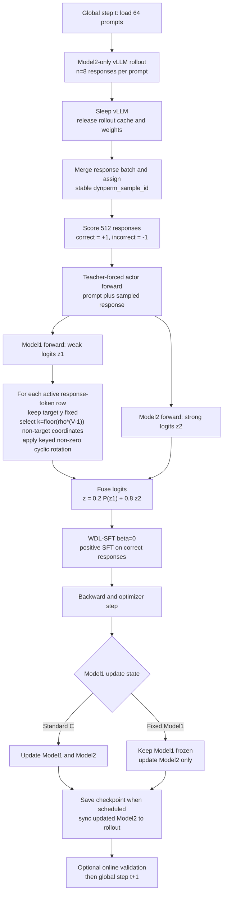

# Target-Preserving Dynamic Permutation MVP

Status: GON-34 implementation and the first formal-script contract are merged into the formal training branch through `425db4d1a1c85906f29499a07f932aa0a4eeb45c`. Candidate-bound CPU and 8xL40S Slurm GPU/FSDP engineering smoke evidence passed. Formal P60 execution and terminal results are governed by separate candidate-bound run receipts; this engineering design does not infer completion from job submission.

## Scope

Dynamic Permutation is a teacher-forced training intervention on the weak branch logits of `QwenJointForCausalLM`. It is disabled for rollout, validation, old/reference log-prob computation, eval-only forwards, and diagnostic counterfactual forwards unless a later approved experiment changes that boundary.

The intervention is configured by `actor_rollout_ref.actor.weak_logit_permutation` and is independent of `freeze_model1`. Different `rho` values do not require rebuilding model caches or changing checkpoint topology.

## Transform contract

For each active supervised causal-logit row, let the hard target be `y` and vocabulary size be `V`.

1. `rho` must be finite and in `[0, 1]`.
2. `k = floor(rho * (V - 1))` non-target coordinates are selected.
3. The target coordinate is never selected and its logit is unchanged.
4. `k = 0` is an exact no-op: the original tensor object is returned before hashing, allocation, or process-global RNG use.
5. `k = 1` fails closed because no fixed-point-free permutation exists.
6. `k >= 2` applies one fixed-point-free cycle to the selected set.

The implementation in `verl/models/joint_model/dynamic_permutation.py` uses a stateless keyed cyclic selected-set:

- the selected non-target coordinates are a cyclic window over compact non-target coordinates, shifted by a hash of `(base_seed, global_step, actor_update_index, dynperm_sample_id, absolute_token_position)`;
- the cycle rotation is non-zero, so selected coordinates have no fixed points;
- selected compact coordinates are lifted back to real vocabulary coordinates by skipping the target index.

This is an exact bijection over the selected set. It preserves the target logit, weak-logit value multiset, weak entropy, and centered-logit norm up to normal floating-point comparison tolerance. It intentionally does not preserve fused entropy, fused target probability, or cross-model affinity.

### Scientific scope of the cyclic MVP

The MVP is not a uniform draw from all permutations of the non-target
vocabulary. At `rho=1`, the selected set is the entire compact non-target
vocabulary and the keyed transform is one non-zero cyclic rotation. At partial
`rho`, the selected set is a keyed cyclic window in compact token-ID order and
the values are rotated within that window. This construction guarantees exact
coverage, no selected-set fixed points, deterministic replay, and bounded index
memory, but it retains more token-ID-order structure than a uniform random
derangement.

Consequently, the formal experiment estimates sensitivity to this
**step-resampled keyed cyclic reassignment**, not sensitivity to every possible
random permutation family. A flat result cannot prove arbitrary token
assignment is irrelevant; a separation can support dependence on the real
assignment or on geometry destroyed by the cyclic intervention. Any later
claim specifically about uniformly random assignment should add a second
permutation family, such as a keyed full-vocabulary bijection, under a separately
reviewed memory and determinism contract.

## Memory and audit budget

The transform processes active rows in chunks. It materializes only `O(row_chunk_size * k)` integer indices, where `k = floor(rho * (V - 1))`; it never constructs a `[token_rows, vocab]` permutation tensor.

Runtime telemetry is bounded:

- always-on counters: requested/realized `rho`, active rows, selected count, selected coordinates, fixed points, target mismatches, audited rows, invariant failures;
- sampled audits: weak entropy error and sorted-value/multiset error over deterministic bounded rows.

Any sampled target, entropy, or multiset invariant failure raises immediately. Exhaustive full-vocabulary sorting belongs in CPU fixtures, not every production token row.

## Determinism identities

The mapping is fully stateless. The seed material is:

- actor base seed;
- restored global optimizer step;
- actor update index, derived from PPO epoch and mini-batch index;
- `dynperm_sample_id`, assigned by the trainer after rollout expansion and final actor-row construction but before worker dispatch, balancing, mini-batching, micro-batching, remove-padding, dynamic batching, or sequence-parallel slicing;
- absolute causal token position.

The mapping is stable across micro-batches, gradient accumulation, and gradient-checkpoint recomputation within the same optimizer update. It changes only when the restored global step or actor update index changes. Rank-local row ordinals, random UUIDs, and DP rank are not seed material.

## Actor and training boundary

`RayPPOTrainer` assigns `dynperm_sample_id` only when the weak-logit permutation config is enabled and passes `global_step` through actor metadata. `DataParallelPPOActor.update_policy` is the only path that sets `apply_weak_logit_permutation=True`.

`compute_log_prob`, reference-policy log-prob, rollout, validation, generation, eval-only, and diagnostic forwards do not enable the transform. Enabling the transform with fused kernels or PrefixGrouper is fail-closed; remove-padding depends on the repository attention backend gate.

The MVP is fail-closed to `policy_loss.loss_mode=wdl_sft`, with `entropy_coeff=0`, actor reference KL disabled, and effective per-submodel KL disabled. PPO/GRPO/IS losses, including `wdl_sft_is` and `wdl_group_adv_is`, form ratios against `old_log_prob`; because those old-log-prob forwards are intentionally unpermuted, enabling Dynamic Permutation would mix the intervention delta into the policy-staleness ratio. Actor KL and submodel KL have the same mismatch against their intentionally unpermuted reference log-probabilities. Supporting any such ratio or reference objective therefore requires a later approved algorithm contract that binds the same permutation identity into its reference-side computation. Nonzero entropy regularization is also excluded from the MVP so the intervention remains a pure teacher-forced WDL-SFT objective; `calculate_entropy=true` remains allowed as detached diagnostics when its coefficient is zero.

## End-to-end step flow

The current Math experiment uses Model2-only rollout. Dynamic Permutation does
not change the responses already sampled in the current global step; it changes
the teacher-forced fused loss and therefore the parameter update that influences
later Model2-only rollouts.

For the frozen P60 contract, `train_batch_size=64`, `rollout.n=8`,
`ppo_mini_batch_size=512`, and `ppo_epochs=1`, so the 512 response rows form one
optimizer mini-batch per global step. The general implementation still includes
`actor_update_index` in the identity for configurations with more than one
optimizer update per global step.

## Gradient effect of the intervention

For one active token row, define

$$
\widetilde z_1=Pz_1,
\qquad
z_m=(1-\lambda)\widetilde z_1+\lambda z_2,
\qquad
p=\operatorname{softmax}(z_m).
$$

For a positive WDL-SFT target token `y`, the fused-logit gradient is

$$
g=\frac{\partial L}{\partial z_m}=p-e_y.
$$

Although `P` leaves the target weak logit and the complete weak value multiset
unchanged, it changes how the weak non-target values pair coordinate-wise with
the strong logits. The fused softmax denominator therefore changes, so the
fused target probability, every fused non-target probability, gradient norm,
gradient direction, and clipping behavior may change.

### Model1 frozen

Model1 still runs forward and supplies `Pz1`, but its parameters have
`requires_grad=False`. Only Model2 receives a parameter update:

$$
\frac{\partial L}{\partial z_2}=\lambda(p-e_y),
\qquad
\frac{\partial L}{\partial\theta_2}
=J_2^\top\lambda(p-e_y).
$$

Relative to unpermuted C at the same frozen state, the direct change in the
Model2 logit gradient is

$$
\Delta g_2=\lambda(p_{perm}-p_{real}).
$$

Thus the intervention is a deterministic, step-varying external perturbation
to Model2's supervision geometry. If the permutation lowers the fused target
probability, the magnitude of the negative target-logit gradient grows and the
aggregate non-target mass grows; if it raises the target probability, both
shrink. The non-target gradient is also redistributed across token coordinates,
so the effect is not a scalar learning-rate change. Model1 cannot compensate by
learning an inverse mapping or changing its spectrum.

### Model1 trainable

Model2 receives the same gradient as above. Model1 additionally receives the
inverse-permuted fused gradient:

$$
\frac{\partial L}{\partial z_1}
=(1-\lambda)P^\top(p-e_y),
\qquad
\frac{\partial L}{\partial\theta_1}
=J_1^\top(1-\lambda)P^\top(p-e_y).
$$

The target coordinate is fixed, so the target-raising signal remains coherent.
For non-target coordinates, however, an original Model1 coordinate receives the
gradient associated with the token coordinate to which its value was moved.
Dynamic resampling prevents Model1 from learning one fixed inverse vocabulary
mapping. It therefore disrupts token-specific weak/strong co-adaptation while
still allowing Model1 to adapt target margins, value spectrum, and other
distribution-level statistics. Because both branches share `p`, Model1's
adaptation also changes Model2's later gradients, and Model2's adaptation changes
the gradient field seen by Model1.

The transform is therefore not equivalent to detached noise. It preserves the
weak branch's target signal and differentiable value path, but scrambles the
semantic assignment of its non-target gradient. The trainable-versus-frozen
factorial edge tests whether any dose effect depends on that co-adaptive path.

## Design-to-code review record (2026-08-21)

The focused review compared the original mechanism narrative, the amended 2x4
P60 experiment contract, the transform/config/actor/trainer implementation, and
the focused CPU tests.

- **PASS:** training-only scope; Model2-only rollout remains unpermuted.
- **PASS:** target coordinate, weak value multiset, weak target probability,
  and weak entropy are preserved for active response-token rows.
- **PASS:** `rho=0` is an allocation/RNG-free no-op; dose uses exactly
  `floor(rho * (V - 1))` selected non-target coordinates.
- **PASS:** identity includes seed, restored global step, actor update, stable
  sample row, and absolute token position; checkpoint replay needs no hidden RNG
  state.
- **PASS:** gradients reach both models in Standard C and only Model2 parameters
  update in fixed-Model1.
- **PASS:** the approved launcher amendment runs both update states at
  `rho={0,0.25,0.5,1}` as continuous P60 trajectories; P20/P30 are checkpoints,
  not separate jobs.
- **INTERPRETATION LIMIT:** the implementation is keyed cyclic reassignment,
  not a uniform random derangement. Results must use the narrower estimand above.
- **TELEMETRY WORDING:** `fixed_points=0` means no fixed point among selected
  coordinates; unselected coordinates at partial `rho` intentionally remain
  fixed.

The exact-image focused review command passed `85` tests covering transform
invariants, actor plumbing, joint-model forward/backward, both freeze states,
checkpoint replay, no-op equivalence, and the formal launcher contract.

## Freeze, checkpoint, and no-op contract

The same joint actor checkpoint remains canonical. It keeps both `sub_models.0.*` and `sub_models.1.*` namespaces; Dynamic Permutation does not add a second checkpoint writer or permutation RNG state.

With `freeze_model1=false`, gradients flow through the gather/scatter permutation into Model1 and Model2 remains trainable. With `freeze_model1=true`, Model1 remains frozen while Model2 trains normally. The engineering no-op oracle is same-candidate `enabled=false` versus `enabled=true,rho=0`; historical C/fixed-M1 equivalence is a later scientific bridge, not the Delivery oracle.

## Current evidence boundary

As of 2026-08-20, the GON-34 code candidate has CPU plus candidate-bound Slurm engineering evidence:

- focused Dynamic Permutation, actor/config plumbing, checkpoint/no-op, sharded-checkpoint capacity estimation, and hardened Slurm-contract gate: `114 passed` in the final focused offline CPU harness with `CUDA_VISIBLE_DEVICES=""`;
- broader `tests/joint_training` still has pre-existing or environment-dependent failures unrelated to the Dynamic Permutation focused gate.
- candidate-bound Slurm Job 146 completed an 8xL40S FSDP engineering smoke with result `PASS`, covering both `freeze_model1=false` and `freeze_model1=true`, checkpoint save/resume, and same-candidate `rho=0` comparison. Its receipt is explicitly `formal_experiment=false`.

The Slurm wrapper remains part of the engineering admission contract: it fail-closes unless the candidate SHA is an exact lowercase 40-hex value, the staged workspace and output roots canonicalize below the intended node-local `workspace/jobs` and `checkpoints/jobs` prefixes, and the node-local preflight records durable GPU-process, Docker-container, and Slurm-allocation receipts showing no foreign workload before the job container starts. Its eight local ranks use explicit `127.0.0.1` static rendezvous so `--network=none` does not depend on container-hostname resolution. Formal training remains outside Delivery. The current execution decision uses one P60-only queue for Standard C and fixed-Model1, configured through `DYNPERM_ENABLED` and `DYNPERM_RHO`; it requires a separate candidate-bound P60 batch receipt.

The resource-threshold smoke uses the production defaults `row_chunk_size=16` and `audit_rows=4`; invariant auditing remains enabled on every active step. The chunk default is the bounded tradeoff required by the 8xL40S gate: chunk 8 passed the 15% memory bound but failed the 25% step-time bound, while the earlier artificial chunk-64/audit-32 stress setting passed time but failed memory.
